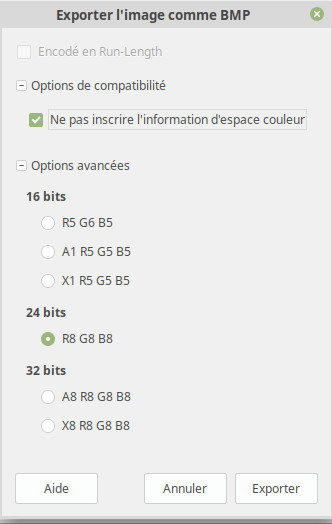
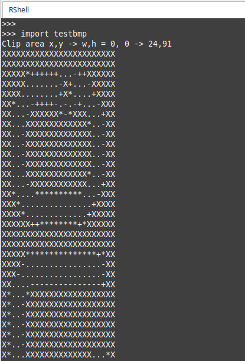

[This file also exists in ENGLISH](readme_ENG.md)

# Support de format de fichiers pour MicroPython
Cette section contien des classes et exemples permettant de lire différents format.

# IMAGES (format supportés)

## Le format bmp
BMP est le format d'image Bitmap de Windows qui couvre une grande variété d'encodage (Bits par couleur, couleurs indexée ou pas, compression ou pas, etc).
Cette bibliothèque supporte le format BMP encodé en RGB888 (24 bits par Pixel).

Le format RGB888 doit être sauvé avec la configuration suivante (cfr Gimp):

La classe `BmpReader` de `imglib/bmp.py` peut lire un fichier bitmap (pour autant qu'il n'est pas compressé!).

* [color-palette.bmp](examples/color-palette.bmp): Exemple d'image 24 bits non compressée.  
* [olimex.bmp](examples/olimex.bmp): Exemple d'image 24 bits non compressée.  

Voir le `examples/testbmp.py` pour voir comment extraire des pixels d'un tel fichier.

Ressource:
* [bmp_file_format @ www.ece.ualberta.ca](http://www.ece.ualberta.ca/~elliott/ee552/studentAppNotes/2003_w/misc/bmp_file_format/bmp_file_format.htm) de Nathan Liesch

## Le format pbm
(encore en développement)

Ressource: http://netpbm.sourceforge.net/doc/pbm.html

# IMAGE bibliothèque helper (img)
La bibliothèque `imglib/img.py` contient des classes et fonctions outils.

La classe `ClipReader` offre un service de clipping sur une image (extraire une sous-section d'une image). Elle s'appuie sur sur les classes de lecture `xxxReader`. Cette classe est donc pratique pour afficher une petite portion d'une plus grande image sur un TFT ;-)

A noter que `ClipReader.show()` permet d'inspecter le contenu du clipping dans le terminal (image au format texte, très pratique pour le débogage)!

La fonction helper `open_image()` identifie le type d'image sur base de l'extension de fichier, créée la classe de lecture appropriée (ex: `BmpReader` pour un fichier .bmp) et l'encapsule dans un `ClipReader` pour bénéficier des possibilités de clipping (découpe).
