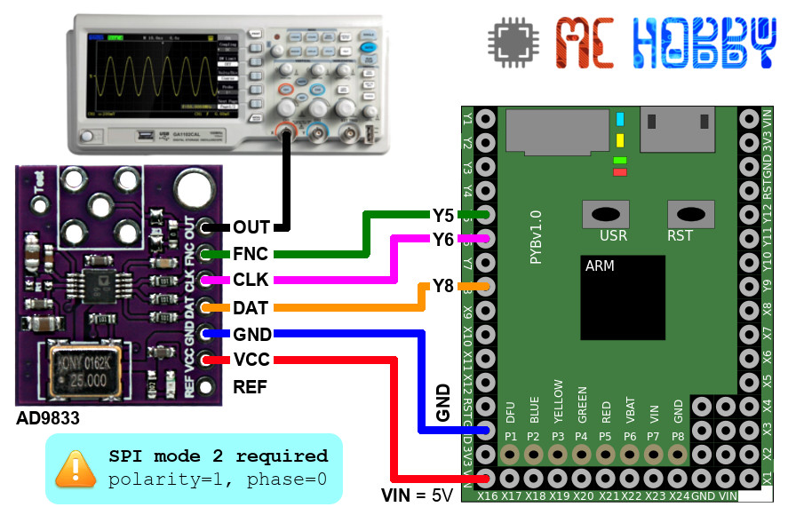

[This file also exists in ENGLISH here](readme_ENG.md)

# Utiliser un AD9833 pour créer un signal sinusoïdal ou triangle avec votre carte MicroPython

The AD9833 est un générateur de signal permettant de créer une sinusoïde, un signal d'horloge, un signal en triangle jusqu'à 12.5 Mhz (avec un cristal a 25 MHz) et une valeur 28 bits.

The AD9833 supporte également le décalage de phase de 0 à 2*Pi (avec une valeur entre 0 et 4096).


La résolution en fréquence sur 28 bits est 12.500.000 / 268.435.455 = 0.06556 Hertz

L' AD9833 genere un signal avec une tension de 0.6 Vpp (pic à pic).

Pour plus d'information, n'hésitez pas à consulter cette [fiche produit](http://shop.mchobby.be/product.php?id_product=1689) .

# Brancher



__ATTENTION__ : les faux contacts (breadboard, fil de mauvaise qualité) seront vos pires ennemis!

# Tester

La bibliothèque `ad9833.py` est disponible dans le sous-répertoire /lib . Ce fichier doit être disponible sur la carte avant d'exécuter le code d'exemple.

Le script `test.py` permet d'exploiter les fonctionnalités principale.

``` python
from machine import Pin, SPI

from ad9833 import *

# SPI doit être initialisé en mode 2 -> Polarity=1, Phase=0
spi = SPI(2, polarity=1, phase=0)
ssel = Pin( "Y5", Pin.OUT, value=1) # Utiliser le /ss

# mclk par défaut est 25000000 (horloge source 25 MHz) sur la plupart des cartes AD9833
gen = AD9833( spi, ssel)

# Initialise l' AD9833 avec un signal sinusoïdale de 1.3KHz, sans décalage de phase
frequency0 = 1300 #  1.3 Khz
frequency1 = 50   #  50 Hz
phase      = 0    # pas de décalage de phase (0..4096)

# Suspendre la sortie
gen.reset = True

# Configurer Freq0
gen.select_register(0)
gen.mode = MODE_SINE
gen.freq = frequency0
gen.phase = phase

# Configurer Freq1
gen.select_register(1)
gen.freq = frequency1
gen.phase = phase

# Activater la sortie sur Freq0
gen.select_register(0)
# Relacher le signal sur la sortie
gen.reset = False
```
Ce qui produit le résultat suivant:


# Où acheter
* [breakout AD9833 - generateur de signal @ MC Hobby](http://shop.mchobby.be/product.php?id_product=1689)
