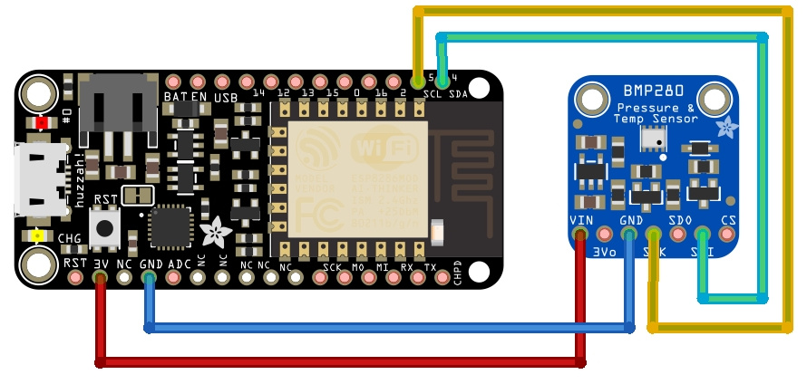
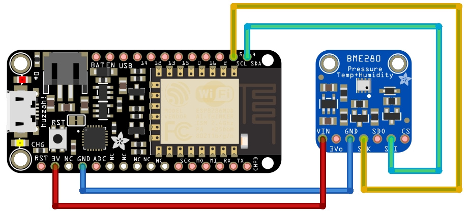
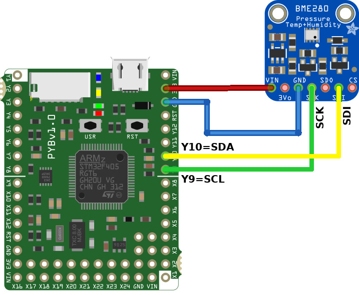

[Ce fichier existe également en FRANCAIS](readme.md)

# Introduction
This library is a driver for the BME280 temperature/pressure/humidity sensor and the BMP280 temperature/pressure that can be used with MicroPython (on ESP8266, Pyboard boards).

This library is sourced from GitHub @ https://github.com/catdog2/mpy_bme280_esp8266 and have been adapted (see the bme280.py file for the credit).

# About the BME280 & BMP280

The BMP280 & BME280 are environmental sensors produced by Bosch. They offers the possibility to measure the athmospherique pressure, the temperature, and so on. The BME280 can also mesure the relative humidity.

Those sensors can use either the I2C bus, either the SPI bus; __This driver is for I2C only__.

* Shop: [Adafruit BMP280 (ADA2651)](http://shop.mchobby.be/product.php?id_product=1118)
* Shop: [Adafruit BME280 (ADA2652)](http://shop.mchobby.be/product.php?id_product=684)
* Wiki: [nos tutoriels MicroPython pour ESP8266](https://wiki.mchobby.be/index.php?title=MicroPython-Accueil#ESP8266_en_MicroPython)
* [BME280 datasheet](https://www.adafruit.com/datasheets/BST-BME280_DS001-10.pdf) Adafruit Industries.

# Wiring

### BMP280 Wiring ###


### BME280 Wiring ###




# Usage
Copy the `bme280.py` library on your board (eg: by using webrepl, rshell, or ampy).

Then use the following sample to read the data from the sensor. You can test the code from a REPL or WebREPL session.

### Testing the BME280 ###

``` python
from machine import Pin, I2C
from bme280 import *

# ESP8266 under MicroPython
i2c = I2C(scl=Pin(5), sda=Pin(4))
# Pyboard
# i2c = I2C(2)
bme = BME280(i2c=i2c)

print(bme.values)
```

### Testing the BMP280 ###

``` python
from machine import Pin, I2C
from bme280 import *

# ESP8266 under MicroPython
i2c = I2C(scl=Pin(5), sda=Pin(4))
# Pyboard
# i2c = I2C(2)
bmp = BME280(i2c=i2c, address=BMP280_I2CADDR )

print(bmp.values)
```

Which produce a  tuple of values with the following _Human Readeable_ information:
* Temperature (in Celcius degrees),
* The Athmosphérique pressure in HectoPascal
* The relative humidity (in percent)<br />For a BMP280 this value will always been equal to 0 since the BMP280 does not have this sensing capability.

``` python
('22.36C', '1005.65hPa', '0.00%')
```

The class also expose the `raw_values` property which returns a tuple of typed data:

The following call:

``` python
print(bmp.raw_values)
```

would produce the following result :

``` python
(22.36, 1005.65, 0.0)
```

# More détails

The `values` property is a convenience method to returns tuple with the various sensor data going with __units__. This returns a tuple of _human-readable_ values (more easy to understand). This is really great to quick check the sensor.

At the root, the method relies on `read_compensated_data()` which returns the raw data tuple `(temperature, pressure, humidity)` where:

* `temperature`: Returns Celcius degree value. Eg: the 2534 value means 25.34 degrees.
* `pressure`: Returns the athmospherique pressure encoded with 32 bits (the 24 first bits are the integer value & the last 8 bits are the fractionnal value). The value must be divided by 256 to extract the Pascals pressure. Eg: the value 24674867 means 96386.2Pa, or 963.862hPa.
* `humidity`: Returns the relative humidity encoded with 32 bits (the 22 firsts bits are the integer value while the last 10 bits is the fractionnal value). To calculate the  %RH, the value must be divided by 1024. Eg: the value 47445 means a 46.333 %RH humidity.
