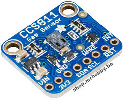
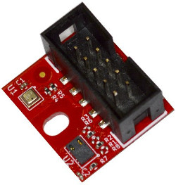
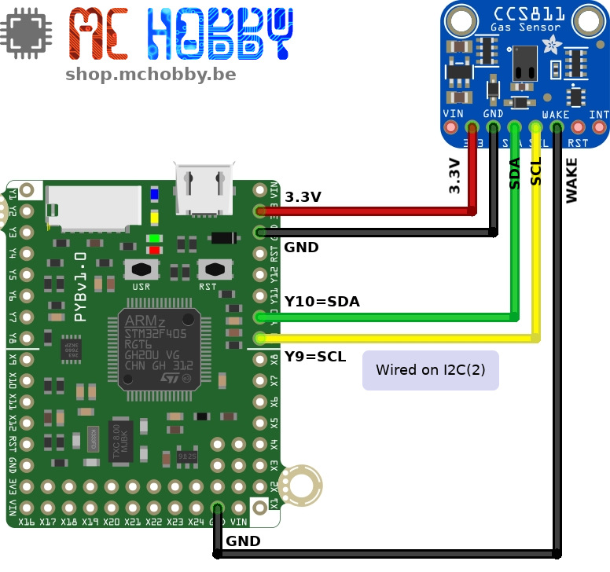

[This file also exists in ENGLISH](readme_ENG.md)

# Mesure du eCO2 et VOC (Composés Organiques Volatiles) avec le CCS811 sous micropython



Ajouter un outil de surveillance de la qualité de l'air sur votre projet à l'aide du [breakout CCS811 Qualité de l'Air d'Adafruit](https://shop.mchobby.be/fr/breakout/1274-ccs811-senseur-qualite-d-air-cov-et-eco2-3232100012745-adafruit.html).

Ce capteur d'AMS est un capteur de gaz capable de détecter une large gamme ce Composés Organiques Volatiles (aussi appelé VOC pour _Volatile Organic Compounds_). Il peut être utilisé pour mesurer la qualité de l'air à l'intérieur des pièces. Lorsqu'il est connecté sur un microcontrôleur pour obtenir une évaluation du TVOC (_Total Volatile Organic Compound_, total des composés organiques volatiles) et un équivalent CO2 (eCO2).

Comme il s'agit d'un composant I2C, les données sont transmisent par l'intermédiaire des deux fils du bus (SDA et SCL).



Le capteur CCS811 est également disponible sur le [capteur environnementale MOD-ENV](https://shop.mchobby.be/fr/uext/1780-capteur-environnementale-tout-en-un-bme280-ccs811-3232100017801.html) produit par Omimex. La bibliothèque convient également pour ce capteur, __voyez les détails dans le sous-répertoire `modenv` de ce dépôt GitHub__.

# Brancher



# Utiliser

La bibliothèque [`ccs811.py`](lib/css811.py) est disponible dans le sous-répertoire `/lib` . Ce fichier doit être disponible sur la carte avant d'exécuter le code d'exemple.

Le script [`test.py`](examples/test.py) permet d'exploiter les fonctionnalités principale.

``` python
import time
import ccs811

from machine import I2C

i2c = I2C( 2 )
ccs811 = ccs811.CCS811( i2c )

# Check if the sensor returns an error
if ccs811.check_error:
	print( "An error occured!")
	print( "ERROR_ID = %s" % ccs811.error_id.as_text )
	while True:
		time.sleep( 0.100 )

# Wait for the sensor to be ready
while not ccs811.data_ready:
	time.sleep( 0.100 )

while True:
    print("CO2: {} PPM, TVOC: {} PPB"
          .format(ccs811.eco2, ccs811.tvoc))
    time.sleep(0.5)
```

Ce qui produit les résultat suivants dans une session REPL.

```
CO2: 423 PPM, TVOC: 3 PPB
CO2: 423 PPM, TVOC: 3 PPB
CO2: 423 PPM, TVOC: 3 PPB
CO2: 423 PPM, TVOC: 3 PPB
... breathing toward the senseor
... souffler en direction du capteur
CO2: 423 PPM, TVOC: 3 PPB
CO2: 423 PPM, TVOC: 3 PPB
CO2: 439 PPM, TVOC: 5 PPB
CO2: 439 PPM, TVOC: 5 PPB
CO2: 454 PPM, TVOC: 8 PPB
CO2: 454 PPM, TVOC: 8 PPB
CO2: 454 PPM, TVOC: 8 PPB
CO2: 454 PPM, TVOC: 8 PPB
CO2: 439 PPM, TVOC: 5 PPB
CO2: 439 PPM, TVOC: 5 PPB
CO2: 439 PPM, TVOC: 5 PPB
CO2: 439 PPM, TVOC: 5 PPB
CO2: 423 PPM, TVOC: 3 PPB
CO2: 423 PPM, TVOC: 3 PPB
CO2: 439 PPM, TVOC: 5 PPB
```

# Où acheter
* [Adafruit CCS811 Air Quality Sensor Breakout](https://shop.mchobby.be/fr/breakout/1274-ccs811-senseur-qualite-d-air-cov-et-eco2-3232100012745-adafruit.html) @ MCHobby
* [Adafruit CCS811 Air Quality Sensor Breakout](https://www.adafruit.com/product/3566) @ Adafruit
* [MOD-ENV : Capteur Environnemental](https://shop.mchobby.be/fr/uext/1780-capteur-environnementale-tout-en-un-bme280-ccs811-3232100017801.html) @ MCHobby
* [MOD-ENV : Capteur Environnemental](https://www.olimex.com/Products/Modules/Sensors/MOD-ENV/open-source-hardware) @ Olimex
