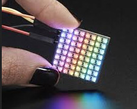
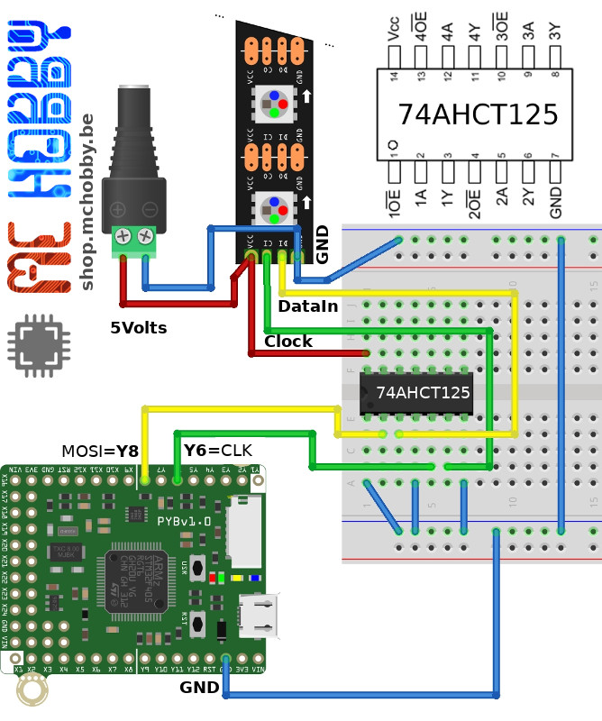

[This file also exists in ENGLISH](readme_ENG.md)

# Bibliothèque DotStar / APA102 pour MicroPython

Les LEDs APA102 (ou DotStar) sont des LEDs chaînables utilisant un protocole mettant en oeuvre un signal de donnée et un signal d'horloge, ce qui offre un meilleur contrôle sur le débit de donnée.
Ces LEDs sont généralement contrôlées à partir d'un bus SPI (signal MOSI et CLK), il faut donc 4 fils au total (alimentation incluse) pour commander ces LEDs.

__Attention:__ Bien que ressemblant à s'y méprendre aux LEDs Neopixels (WS2812b) mais leur fonctionnement est fondamentalement différent.



La bibliothèque `micropython_dotstar.py` a été modifié pour créer une bibliothèque `dotstar.py` capable de fonctionner sur des cartes MicroPython avec moins de RAM.

La bibliothèque originale `micropython_dotstar.py` proviennant du [dépot GitHub micropython-dotstar de mattytrentini](https://github.com/mattytrentini/micropython-dotstar) ne pouvait pas
être parsée sur une [Pyboard Lite](https://shop.mchobby.be/fr/micropython/765-micro-python-pyboard-lite-3232100007659.html) ou sur une
[PYBStick Lite](https://shop.mchobby.be/fr/micropython/1830-pybstick-lite-26-micropython-et-arduino-3232100018303-garatronic.html) parce
qu'il n'y a pas assez de RAM disponible pour effectuer l'opération de parsing.

# Quelles modifications ?
La bibliothèque `dotstar.py` a été créée en:
1. Retirant tous les commentaires afin de permettre son parsing sur la Pyboard Lite (il en reste encore quelques un)
2. En placant l'entête (auteur, licence, etc) dans le fichier `dotstar.header` non parsé par MicroPython
3. En retirant le contrôle dynamique de la luminosité du ruban (car alloue un second buffer de la même taille). Le contrôle de la luminosité individuel sur chaque LED est néanmoins toujours possible.

# Documentation

La documentation de la bibliothèque originale [`micropython_dotstar` de mattytrentini](https://github.com/mattytrentini/micropython-dotstar) (GitGub) est toujours applicable.

A noter que la bibliothèque fonctionne en mode `auto_write = True`, le ruban est automatiquement mis à jour lors de la modification de couleur d'une LED.

# Brancher

Les signaux `DataIn` et `Clock` des LEDs DotStar/APA102 doivent être du même niveau logique que l'alimentation.

__Notes:__
* Un niveau logique 3.3V pour les signaux avec une alimentation 5V fonctionne parfois mais cela est fort incertain (testé par nos soins).
* Bien qu'il soit possible d'alimenter les LEDs sous 3.3V c'est la tension d'alimentation de 5V qui est le plus couramment utilisé.

Le schéma suivant montre le branchement de LEDs APA102 sur une Pyboard et une alimentation externe de 5V. Un convertisseur de niveau logique [74AHCT125](https://shop.mchobby.be/fr/ci/1041-74ahct125-4x-level-shifter-3v-a-5v-3232100010413.html) est utilisé pour la conversion de niveau logiques.



Le schéma ci-dessous utilise la tension d'alimentation Vin sur un PYBStick. Comme celui-ci est branché sur ordinateur, la tension présente sur Vin est de 4.85V. Comme le convertisseur de niveau logique [74AHCT125](https://shop.mchobby.be/fr/ci/1041-74ahct125-4x-level-shifter-3v-a-5v-3232100010413.html) est également utilisé, le montage fonctionne parfaitement.


# Exemple

L'exemple suivant (pour un Pyboard) permet de contrôler les 3 LEDs APA102 à partir de la Pyboard.

A noter qu'il est nécessaire de définir la broche miso même si elle n'est pas utilisée.

```
>>> from dotstar import DotStar
>>> from machine import SPI, Pin
>>> spi = SPI( sck=Pin("Y6"), miso=Pin("Y7"), mosi=Pin("Y8") )
>>> leds = DotStar( spi, 3 )
>>> leds.fill( (255,0,0) )
>>> leds.fill( (0,255,0) )
>>> leds.fill( (0,0,255) )
>>> leds[0]=(255,0,0)
>>> leds[1]=(0,255,0)
```

Ce second exemple (pour la PYBStick lite) démonte l'utilisation avec la PYBStick.

```
MicroPython v1.11-473-g86090de on 2019-11-15; PYBv1.1 with STM32F405RG
Type "help()" for more information.
>>>
>>> from dotstar import DotStar
>>> from machine import SPI, Pin
>>> spi = SPI( sck=Pin("S23"), miso=Pin("S21"), mosi=Pin("S19") )
>>> leds = DotStar( spi, 3 )
>>> leds.fill( (255,0,0) )
>>> leds.fill( (0,255,0) )
>>> leds.fill( (0,0,255) )
>>> leds[0]=(255,0,0)
>>> leds[1]=(0,255,0)
```

# Où acheter
* [LED DotStar (APA102)](https://shop.mchobby.be/fr/55-neopixels-et-dotstar) sont disponibles dans cette gamme chez MCHobby
* [PYBStick 26 Lite - Carte MicroPython et Arduino](https://shop.mchobby.be/fr/micropython/1830-pybstick-lite-26-micropython-et-arduino-3232100018303-garatronic.html)
* [Cartes MicroPython](https://shop.mchobby.be/fr/56-micropython) gamme chez MCHobby
