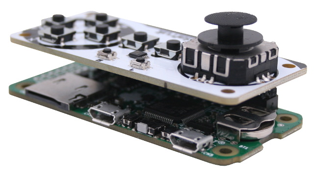
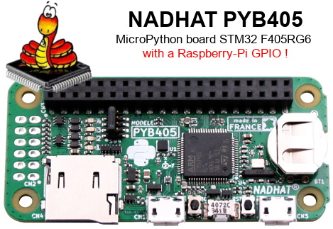
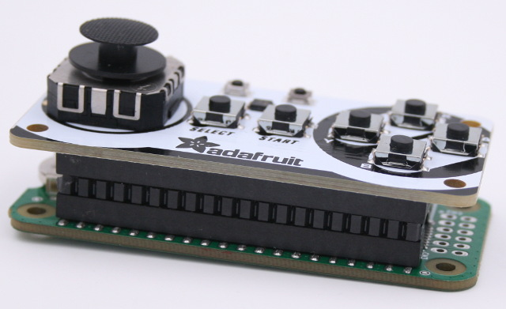

[This file also exists in ENGLISH here](readme_ENG.md)

# Utiliser un HAT Joy-Bonnet avec MicroPython (NADHAT PYB405)



Le __Hat Joy Bonnet__ est HAT Gaming I2C + GPIOs créé par [Adafruit Industries](https://www.adafruit.com) pour faire du Rétro-Gaming Pi-Zero mais rien n'empêche de l'utiliser avec une carte MicroPython!

Par chance, il existe la carte [MicroPython NADHAT-PYB405](https://shop.mchobby.be/fr/micropython/1653-hat-micropython-pyb405-nadhat-3232100016538-garatronic.html) qui expose un port GPIO 40 broches compatible avec le Raspberry-Pi!

## A propos de NADHAT PYB405

la carte [MicroPython NADHAT-PYB405](https://shop.mchobby.be/fr/micropython/1653-hat-micropython-pyb405-nadhat-3232100016538-garatronic.html) qui expose __un port GPIO 40 broches compatible avec le Raspberry-Pi__ et tous les bienfait de la carte MicroPython originale avec quelque plus comme:

* Un connecteur avec 4 sorties (collecteur ouvert 100mA) + 4 entrées (tolérantes 16V)
* Un connecteur pour pile bouton (pour toujours rester à l'heure!)
* Un bouton pour activer la mode DFU (facilite la mise-à-jour)
* Un format pHat (donc près a visser sur les Pi et hats avec des entretoises)

Bref, comme la Pyboard mais avec une autre approche pour la connectique. Une bonne idée.

# Raccordement
Rien de plus simple, il suffit de brancher un connecteur mâle double rang (PinHeader) sur la Pyb405 puis insérer le HAT dessus.



Voici les détails du brochage PYB405 <-> Joy Bonnet lorsqu'il est branché dessus.

Le schéma reprend les GPIO Raspberry-Pi et la correspondance avec broches MicroPython.


# Tester
Les pilotes `JoyBonnet` (joybonnet.py) et `ADS1015` (ads1x15.py) doivent être accessibles dans les bibliothèques de votre carte MicroPython.

__Remarque:__ le bouton "Player 2" ne peut pas être utilisé car il est raccordé sur la broche Reset du MicroContrôleur NADHAT PYB405. Presser le bouton "Player 2" redémarre la carte Pyboard.

## Exemple simple
Le fichier `test.py` détaillé ci-dessous permet de tester les boutons et le Joystick analogique du Joy Bonnet.

Une fois copié sur la carte, il est possible d'importer le fichier de test `import test` .

``` python
from machine import I2C
from joybonnet import JoyBonnet
from time import sleep

# NADHAT PYB405 with HAT connector
i2c = I2C( 1 )
joy = JoyBonnet( i2c )
```

Lecture de l'état d'un bouton en le nommant. Les noms disponibles sont 'A', 'Y', 'X', 'B', 'PLAYER2', 'SELECT', 'START' et 'PLAYER1'.

```
print( "Presser le bouton START" )
for i in range( 10 ):
	print( '%i/10 -> lecture bouton START = %s' %(i, joy.button('START')) )
	sleep( 1 )
```

Lecture de l'état de tous les boutons! Retourne un dictionnaire avec l'état de tous les boutons.

Ex: {'START': 0, 'Y': 0, 'PLAYER1': 0, 'A': 0, 'X': 0, 'SELECT': 0, 'B': 0}

``` python
print( "Presser les boutons" )
for i in range( 10 ):
	print( '%i/10 -> all button = %s' %(i, joy.all_buttons) )
	sleep( 1 )
```

Lecture de l'état du Joystick avec la propriété `joy.axis` qui retourne un tuple de deux valeurs `(axe_x, axe_y)` . Retourne une valeur entre -100 et +100 pour chaque axe (voir graphiques ci-avant pour détail des axes). Ces valeurs correspondent aux lectures sur l'ADC et mise à l'échelle par la bibliothèque.

Durant l'initialisation de `JoyBonnet`, la bibliothèque capture les valeurs ADC (0 à 1652) correspondant à la position repos du joystick (`JoyBonnet.x_center`). A noter qu'un seuil de déplacement minimum est requis (`JoyBonnet.x_thresold`), celui est fixé à 10 unités (sur 826) dans les deux sens (+ et -).

``` python
# Lecture des axes X,Y entre -100 <-> +100
print( "Déplacer le Joystick" )
for i in range( 20 ):
	print( 'x, y = %i, %i' % joy.axis )
	sleep(0.5)
```

__Bonus:__ Les différentes broches GPIO sont initialisée par l’intermédiaire d'un dictionnaire passé au constructeur voir déclaration de `DEFAULT_PIN_SETUP`.

Il est possible d'inspecter cette définition et manipulation par la bibliothèque :-)

``` python
# Enumérer le nom des boutons
print( joy.pin_setup.keys() )
```
Ce qui affiche

`dict_keys(['A', 'Y', 'X', 'B', 'PLAYER2', 'SELECT', 'START', 'PLAYER1'])`

# Ou acheter
* [MicroPython NADHAT-PYB405](https://shop.mchobby.be/fr/micropython/1653-hat-micropython-pyb405-nadhat-3232100016538-garatronic.html) @ MCHobby.be
* [Gamepad PiZero - Joy Bonnet (Adafruit 3464)](https://shop.mchobby.be/fr/pi-zero-w/1116-gamepad-pizero-joy-bonnet-3232100011168-adafruit.html) @ MCHobby.be
