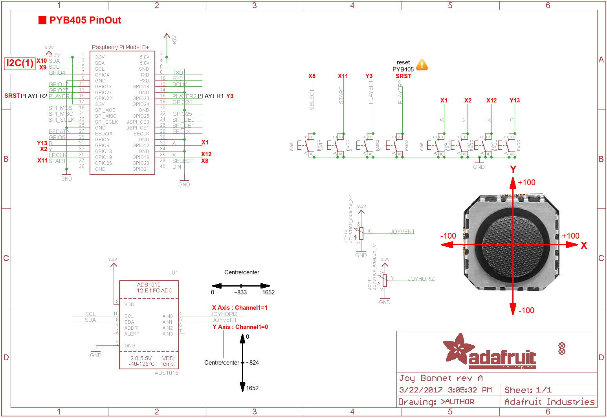

[Ce fichier existe également en FRANCAIS ici](readme.md)

# Use a Joy-Bonnet HAT with MicroPython (NADHAT PYB405)


The __Joy Bonnet HAT__ is an I2C + GPIOs gaming hat created by [Adafruit Industries](https://www.adafruit.com) to create Pi Zero's based Retro-Gaming. But we can also use it with a MicroPython board!

Thankfully, the [MicroPython NADHAT-PYB405](https://shop.mchobby.be/fr/micropython/1653-hat-micropython-pyb405-nadhat-3232100016538-garatronic.html) board exists and expose a 40 pin Raspberry-Pi compatible GPIO!

## About the NADHAT PYB405

The [MicroPython NADHAT-PYB405](https://shop.mchobby.be/fr/micropython/1653-hat-micropython-pyb405-nadhat-3232100016538-garatronic.html) board expose a __40 pins GPIO connector made compatible sith Raspberry-Pi__ together with all the goodies of MicroPython originale board. Garatronic did also add kind features like:

* A connector with 4 output (open collector) + 4 inputs (16V tolerant)
* A coin battery to keep the RTC right on track
* A button to activate the DFU mode (to ease the upgrade)
* pHat form-factor compatible (so ready to screw spacers between the Pi and the HAT).

To summarize, as the Pyboard but with different approach for connectors. A great idea.

# Wiring
Nothing could be simplier. just plug a double-rows pinHeader on the PYB405 then insert the HAT on the TOP.


Here is the pinout details for PYB405 <-> Joy Bonnet (when the bonnet is plug onto the board).

The schematic show the Raspberry-Pi GPIO and corresponding MicroPython pins.



# Test
The drivers `JoyBonnet` (joybonnet.py) and `ADS1015` (ads1x15.py) must be available in the library path of the MicroPython board.


__Remark:__ the "Player 2" button can't be used because it is wired to the NADHAT PYB405 "RESET" pin. Pressing the player 2 button restart the board.

## Simple example
The `test.py` file (detailled here under) can be used to test the buttons and the Joy Bonnet's analog joystick.

Once copied on the board, the file can be tested from REPL with `import test` .

``` python
from machine import I2C
from joybonnet import JoyBonnet
from time import sleep

# NADHAT PYB405 with HAT connector
i2c = I2C( 1 )
joy = JoyBonnet( i2c )
```

Read the state of the button by using its name. The name available are 'A', 'Y', 'X', 'B', 'PLAYER2', 'SELECT', 'START' and 'PLAYER1'.

```
print( "Press the START button" )
for i in range( 10 ):
	print( '%i/10 -> read the START button = %s' %(i, joy.button('START')) )
	sleep( 1 )
```

Read the state of all the buttons! Returns a dictionnary with the button states.

Ex: {'START': 0, 'Y': 0, 'PLAYER1': 0, 'A': 0, 'X': 0, 'SELECT': 0, 'B': 0}

``` python
print( "Press buttons!" )
for i in range( 10 ):
	print( '%i/10 -> all button = %s' %(i, joy.all_buttons) )
	sleep( 1 )
```

Read the joystick state with the `joy.axis` proprety returning a tuple with 2 values `(x_axis, y_axis)` . The values are un the range -100 to +100 for each axis (see the pictures here before for the axis details). Such values comes from the reading on the ADC converter plus scale operation.

When the `JoyBonnet` get initialized, the library capture the ADC values (0 to 1652) for the joystick central position -rest position- (see `JoyBonnet.x_center`). Please note that a minimum thresold around the center is needed to get a response from axis (see `JoyBonnet.x_thresold`). This thresold is about of 10 unit (on 826) in the both direction (+ & -).

``` python
# Read X,Y axis between -100 <-> +100
print( "Move the the Joystick" )
for i in range( 20 ):
	print( 'x, y = %i, %i' % joy.axis )
	sleep(0.5)
```

__Bonus:__ The various GPIO pins are initialized through a dictionnary parameter for the constructor (see `DEFAULT_PIN_SETUP`).

You can have a look to it's definition (and manipulation by the library) :-)

``` python
# Enumérer le nom des boutons
print( joy.pin_setup.keys() )
```
Which displays

`dict_keys(['A', 'Y', 'X', 'B', 'PLAYER2', 'SELECT', 'START', 'PLAYER1'])`

# Where to buy
* [MicroPython NADHAT-PYB405](https://shop.mchobby.be/fr/micropython/1653-hat-micropython-pyb405-nadhat-3232100016538-garatronic.html) @ MCHobby.be
* [Gamepad PiZero - Joy Bonnet (Adafruit 3464)](https://shop.mchobby.be/fr/pi-zero-w/1116-gamepad-pizero-joy-bonnet-3232100011168-adafruit.html) @ MCHobby.be
