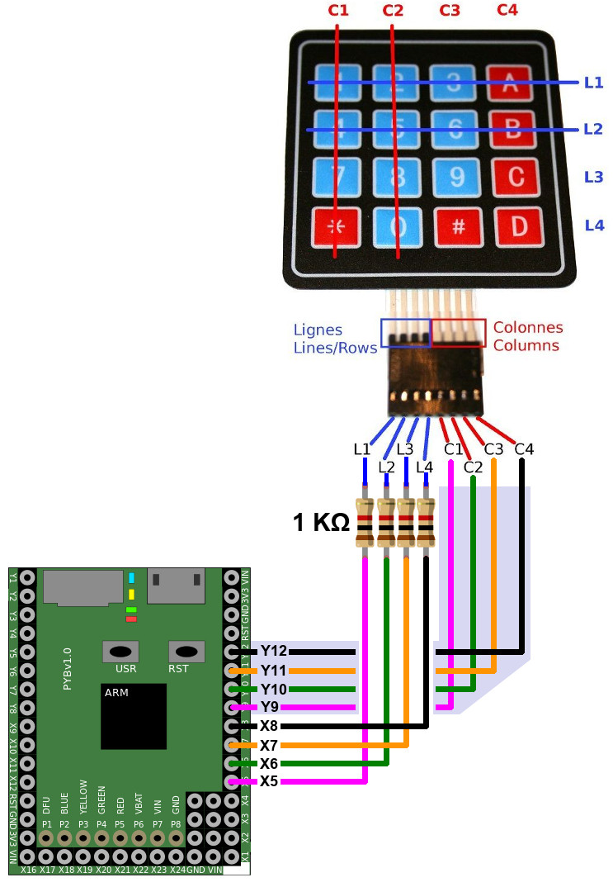

[This file also exists in ENGLISH here](readme_ENG.md)

# Utiliser un clavier 16 touches à membrane (Keypad) avec MicroPython PyBoard

Un keypad/clavier à membrane est constitué d'une matrice de lignes et colonnes avec des touches aux intersections.  


Ce type d'interface, permet de réaliser des périphériques de saisie simple et efficace.

Il est assez facile de mettre un tel clavier en oeuvre à l'aide de de broches d'entrées/sorties (8 dans le cas présent).

# Brancher



* Lignes (1-4): X5-X8 configurées en __SORTIE__ (avec R protection 1K)
* Colonnes (1-4): Y9-Y12 configurées en __ENTREE__ (avec PullUp)

# Tester
Après avoir copié la bibliothèque `keypad.py` sur le système de fichier MicroPython. Il est possible d'utiliser la méthode `Keypad.read()` pour faire une lecture de la pression d'une touche.

La méthode `Keypad4x4.read_key()` va encore plus loin en retournant le libellé de la touche pressée ("1","2", ... "A", "B", ... "*", "# ").

``` Python
""" Essaye continuellement de lire une touche sur un clavier/keypad 4x4 """
from keypad import Keypad4x4
from time import sleep

k = Keypad4x4()

while True:
	# retirer le parametre 'timeout' pour un timeout infini
	key = k.read_key( timeout=2 )
	print( key )
```
Voir aussi les exemples [`test_scan.py`](examples/test_scan.py) qui scanne la matrice et [`test_entercode.py`](examples/test_entercode.py) qui permet de saisir un code sur le clavier.

# Où acheter
* [Clavier 16 touches souple (Keypad)](https://shop.mchobby.be/fr/tactile-flex-pot-softpad/83-clavier-16-touches-souple-3232100000834.html) @ MCHobby
