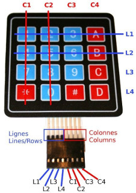

[Ce fichier existe aussi en FRANCAIS](readme.md)

# Use a 16 keys membrane keypad with MicroPython PyBoard

A membrane Keypad is made of matrix with lines and columns with the keys at the various intersections.  



This kind of interface can be used to create simple and efficent input interface.

It is easy to put such hardware at work with some digital input/output (8 in this case).

# Wiring


* Lines (1-4): X5-X8 setup as __OUPUT__ (with 1 KOhms protective resistor)
* Columns (1-4): Y9-Y12 setup as __INPUT__ (with PullUp)

# Test
First, you will need to copy the `keypad.py` library on the MicroPython file system. It is possible to use the `Keypad.read()` method to read te pressure on a key.

The `Keypad4x4.read_key()` method goes further and will returns the label of the label of the pressed key ("1","2", ... "A", "B", ... "*", "# ").

``` Python
""" Continuously tries to read a key on 4x4 keypad """
from keypad import Keypad4x4
from time import sleep

k = Keypad4x4()

while True:
	# remove the 'timeout' parameter for infinite timeout
	key = k.read_key( timeout=2 )
	print( key )
```
see also the examples [`test_scan.py`](examples/test_scan.py) which scan the matrix and [`test_entercode.py`](examples/test_entercode.py) which allow to key-in a code on the keypad.

# Shopping list
* [16 key membrane keypad (Keypad)](https://shop.mchobby.be/fr/tactile-flex-pot-softpad/83-clavier-16-touches-souple-3232100000834.html) @ MCHobby
