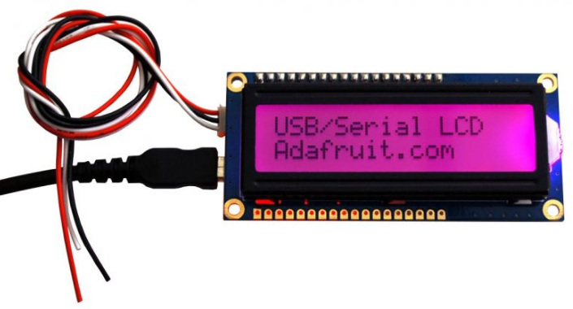
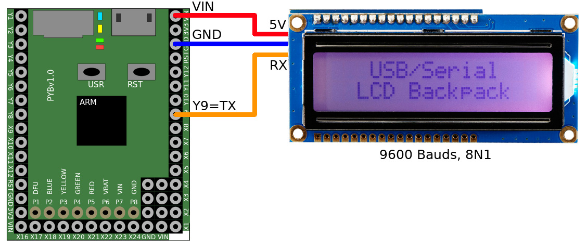

[Ce fichier existe également en FRANCAIS ici](readme.md)

CURRENTLY UNDER TRANSLATION


# Utiliser un afficheur LCD RGB 2x16 caractères avec backpack USB/Série

Cette bibliothèque propose un pilote pour gérer le backpack Adafruit USB+Série LCD qui propose un affichage LCD Matrice (2x 16 caractères) et rétro-éclairage RGB.



Pour plus d'information, n'hésitez pas à consulter notre [fiche produit](http://shop.mchobby.be/product.php?id_product=475) ou [notre tutoriel Arduino & Raspberry-Pi](http://wiki.mchobby.be/index.php?title=LCD-USB-TTL).

# brancher

Le backpack utilise une logique 5V. Il est possible de le brancher directement sur la Pyboard car celle-ci est tolérante 5V. Idéalement, il faudrait utiliser un [_Level Shifter_](https://shop.mchobby.be/fr/breakout/131-convertisseur-logique-4-canaux-bi-directionnel-i2c-compatible-3232100001312-adafruit.html).



# Utiliser

Le bibliothèque contient différents exemples: `writetest.py`, `fulltest.py`, `frenchtest.py` . Le script `frenchtest.py` permet d'utiliser la matrice LCD avec des caractères européen comme é,è,ê,ç,€ .

Le script `writetest.py` est le plus simple et présente déjà une grande partie des fonctionnalités de la bibliothèque.

```
from pyb import UART
from lcdmtrx import LcdMatrix
import time

uart = UART(3, 9600) # RX = Y10, TX = Y9

LCD_COLS = 16 # Taille du LCD 16 caractères x 2 lignes
LCD_ROWS = 2


lcd = LcdMatrix( uart )

# Initialiser la taille du LCD (et sauver dans l'EEPROM)
lcd.set_lcd_size( LCD_COLS, LCD_ROWS )
lcd.clear_screen()


# Activer/désactiver le rétro-éclairage
lcd.activate_lcd( True );

# Constrat par défaut
lcd.contrast()

# Luminosité max + couleur RGB
lcd.brightness( 255 )

# Couleur RBG
#lcd.color( 255, 17, 30 )
lcd.color( 0, 255, 0 )

# Position d'origine
lcd.clear_screen()

# Auto Scroll
lcd.clear_screen()
lcd.autoscroll( True )
lcd.write("Voici du texte..")
time.sleep(1)
lcd.write("Un peu plus....")
time.sleep(1)
lcd.write(" Et ca scroll:-)")
time.sleep(1)

# Tester avec le retour à la ligne
# \r fait un retour à ligne et est insensible à la valeur de autoscroll.
lcd.autoscroll( False )
lcd.clear_screen()
lcd.write( "Ligne 1\rLigne 2" )
time.sleep(1)

# Si on ecrit une longue ligne de texte, seul les "x" derniers
# caractères seront affichés sur la ligne du LCD... SANS SAT DE
# LIGNE. Les "y" premiers caractères sont simplement ignorés!
lcd.autoscroll( True )
if (LCD_ROWS == 4):
	lcd.write("Voici une longue longue ligne de texte  ")
else:
	lcd.write("Voici une longue ligne...")
time.sleep(1)

# Déplacement du curseur
lcd.clear_screen()
lcd.autoscroll( False )
lcd.position( 1, 1 )
lcd.write( 'a' )
lcd.position( 1, LCD_COLS )
lcd.write( 'b' )
lcd.position( LCD_ROWS, 1 )
lcd.write( 'c' )
lcd.position( LCD_ROWS, LCD_COLS )
lcd.write( 'd' )

lcd.writepos( 1, 7, ':-)' ) # Déplacement de curseur + affichage
```

# Où acheter
* [USB/Serial LCD Backpack @ MC Hobby](http://shop.mchobby.be/product.php?id_product=475)
* [USB/Serial LCD Backpack @ Adafruit](https://www.adafruit.com/product/782)
