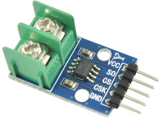
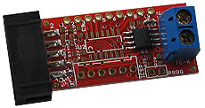
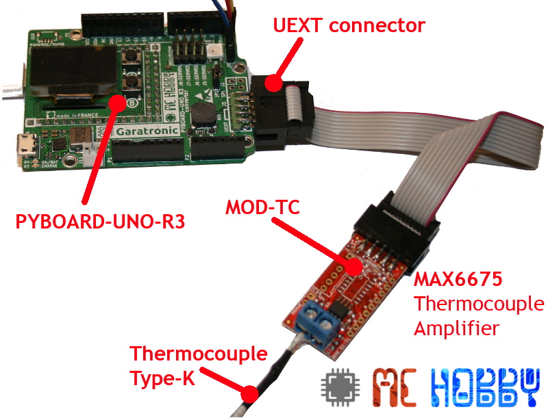

[Ce fichier existe également en FRANCAIS](readme.md)

# Use a MAX6675 (Type-K thermocouple amplifier) to read the temperature with MicroPython

The MAX6675 digitizes the signal from a type-K thermocouple and output the data in 12-bit resolution (Oneway SPI, SPITM-compatible, read-only format).

This converter resolves temperatures to 0.25°C, allows readings as high as +1024°C (with properly glassfiber protected thermocouple) and exhibits thermocouple accuracy of 8 LSBs for temperatures ranging from 0°C to +700°C.

The MAX6675 is very popular and present on many breakouts.



The MOD-TC is an Olimex's MAX6675 board with UEXT connector for easy connection on board exposing UEXT quick connector



# Wiring

##  The MAX6675 breakout on PyBoard

__To do__

## MOD-TC (MAX6675) : UEXT connector on Pyboard

You can prepare a [UEXT breakout for Pyboard](https://github.com/mchobby/pyboard-driver/tree/master/UEXT) to quickly plug UEXT modules on the Pyboard.


You can also connect the MOD-TC through the [PYBOARD-UNO-R3](https://github.com/mchobby/pyboard-driver/tree/master/UNO-R3) adapter.



# Test

## Care about the thermocouple wiring polarity
There is polarity on the thermocouple.

By example, around 24...27°C ambiant temperature, a Type-K will produce somewhat the same result in right and improper connections. Without care, you would probably not notice the connection issue.

__However, if the sensor returns a decreasing temperature when it should be increasing then you know that the thermocouple is connected the wrong way.__


In such case, __just switch over the connections__ of the thermocouple on the terminals :-)

## max6675 library

Before using the sample scripts, you will need to copy the __max6675 library__ to your micropython Pyboard.
* Copy the `max6675.py` file to your micropython board.

You can also transfer the `test*.py` test scripts to the micropython board.

## MOD-TC example

The `test_max6675_uext.py` script allow you to test the Olimex's MOD-TC breakout.

``` python
from max6675 import MAX6675
from time import sleep

print( "MAX6675 - thermocouple reading")
# PYBOARD-UEXT adapter -> cs_pin = "Y5"
# sensor = MAX6675( data_pin = "Y7", clk_pin = "Y6" , cs_pin="Y5" )

# PYBOARD-UNO-R3 adapter -> cs_pin = "X8"
sensor = MAX6675( data_pin = "Y7", clk_pin = "Y6" , cs_pin="X8" )


# Wait the MAX6675 to stabilize
sleep( 0.500 )

while True:
	print( "C = %s" % sensor.temperature )
	sleep(1)
```

Which produce the following results when the script is run on the Pyboard

```
C = 24.25  --> ambiant temperature
C = 23.75
C = 24.0
C = 23.75
C = 24.0
C = 26.0   --> finger contact
C = 28.25
C = 29.5
C = 30.5   --> remove finger
C = 28.75
C = 28.5
C = 27.75
C = 27.0
C = 26.0
C = 25.5
C = 26.0
C = 25.5
C = 24.75  --> ambiant temperature
C = 24.5
C = 24.75
C = 24.75
...
```

## breakout MAX6675 example

__To do__

# Shopping list
* [MicroPython board](https://shop.mchobby.be/fr/56-micropython) @ MCHobby
* [MOD-TC with MAX6675](https://shop.mchobby.be/fr/nouveaute/1623-mod-tc-interface-thermo-couple-type-k-avec-max6675-et-connecteur-uext-3232100016231-olimex.html) @ MCHobby
* [MOD-TC with MAX6675](https://www.olimex.com/Products/Modules/Sensors/MOD-TC/open-source-hardware) @ Olimex
