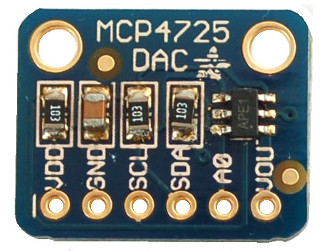
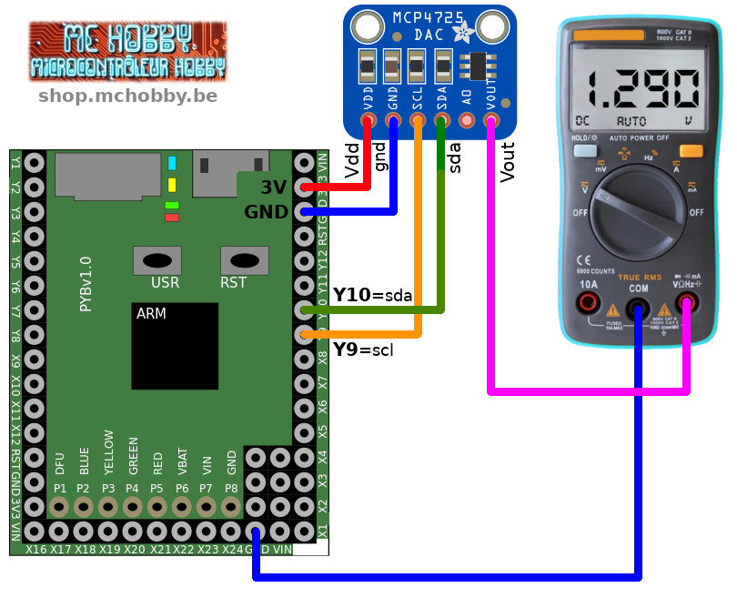
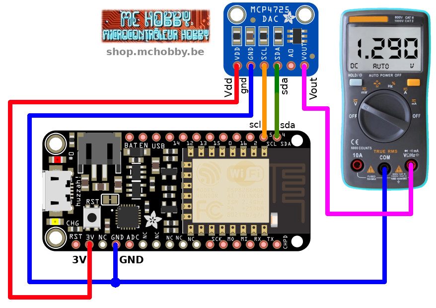

[This file also exists in ENGLISH](readme_ENG.md)

# Ajouter une sortie DAC sous MicroPython avec le Adafruit MCP4725 (ADA935) et MicroPython

Beaucoup de microcontrôleur dispose d'un ADC permettant de lire une tension analogique mais très peu d'entre eux dispose d'une VRAIE sortie analogique.

Grâce au MCP4725, il est possible de générer une tension de sortie arbitraire via le bus I2C. Avec une bonne bande passante, il est même possible de générer une forme d'onde arbitraire, une onde sinusoïdale ou un point de biais ajustable.



 Fonctionne en logique 3.3V ou 5V. Le breakout propose une broche d'adresse A0 (LOW par defaut), il est donc possible de connecter ces DACs sur un bus I2C.

# Raccordement

## MicroPython Pyboard



## Feather ESP8266 sous MicroPython



# Tester

Pour pouvoir utiliser cette carte Breakout, il est nécessaire d'installer la bibliothèque `mcp4725.py` sur la carte MicroPython.

Le code de test suivant initialise la sortie du DAC à VDD/3 = 3.3/2 = 1.65 V.

```
from machine import I2C
from mcp4725 import MCP4725
from time import sleep

# Pyboard - SDA=Y10, SCL=Y9
i2c = I2C(2)
# ESP8266 sous MicroPython
# i2c = I2C(scl=Pin(5), sda=Pin(4))

mcp = MCP4725( i2c = i2c )
# Fixer la sortie sur VDD/2 (ou 3.3/2 = 1.65V)
# Value est en 16 bits, 0 à 65535
mcp.value = int(65535/2)
print( "Sortie @ 1.65v")
```

Ce second exemple manipule le DAC pour créer une rampe de 0V à +VDD (0 à 65535) aussi vite que possible.

```
from machine import I2C
from mcp4725 import MCP4725
from time import sleep

# Pyboard - SDA=Y10, SCL=Y9
i2c = I2C(2)
# ESP8266 sous MicroPython
# i2c = I2C(scl=Pin(5), sda=Pin(4))

mcp = MCP4725( i2c = i2c )
while True:
	# Faire une rampe aussi rapidement que possible
	for i in range( 65535 ): # 16 bits
		mcp.value = i
```

Le DAC est principalement limité par le débit du bus I2C. Les 65535 échantillons sont envoyés en 11 secondes, soit 5957 échantillons par secondes ou un échantillon toutes les 167µSec! De quoi assurer la génération de signal avec un timer à 5 KHz (200µS entre chaque échantillon)

# Ressources et sources
* Source: [MicroPython-adafruit-bundle](https://github.com/adafruit/micropython-adafruit-bundle/tree/master/libraries/drivers) (Adafruit, GitHub)

## Adresse I2C
__L'adresse par défaut est 0x62__ .

Elle peut être adaptée à l'aide du bit d'adresses A0 exposé sur la carte breakout.

# Où acheter
* [Adafruit MCP4725 (ADA935)](https://shop.mchobby.be/product.php?id_product=132) @ MC Hobby
* [Adafruit MCP4725 (ADA935)](https://www.adafruit.com/product/935) @ Adafruit
