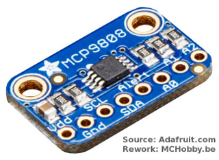
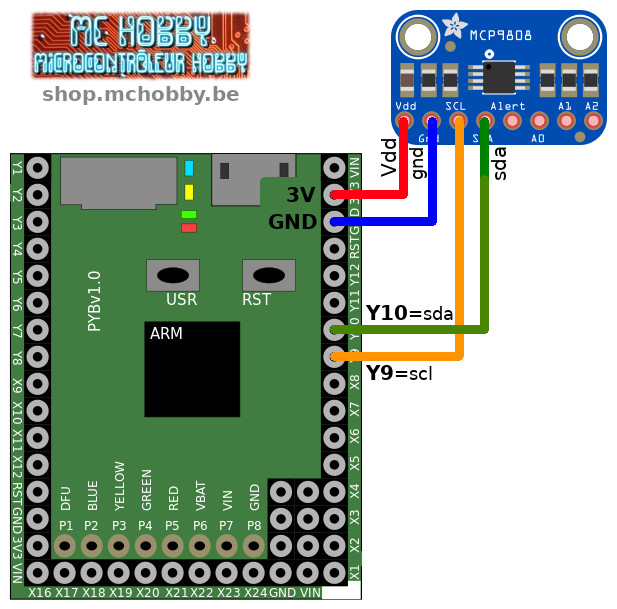

[This file also exists in ENGLISH](readme_ENG.md)

# Mesure de précision de la température avec Adafruit MCP9808 (ADA1782) et MicroPython

Ce capteur température est l'un des plus précis existant avec une précision de +/-0.25°C pour une gamme de température de -40°C à +125°C.



Ce capteur fonctionne sur un bus I2C et dispose de 3 broches d'adresses. Il est donc possible de placer jusqu'à 8 capteurs sur un même bus.

* Contrôle via I2C simple
* Précision typique de 0.25°C sur la gamme -40°C à 125°C range (0.5°C garanti max de  -20°C à 100°C)
* Résolution 0.0625°C
* 2.7V à 5.5V (alimentation et logique)
* courant: 200 μA (typique)

# Raccordement

## MicroPython Pyboard



## Feather ESP8266 sous MicroPython


# Code de test

Pour pouvoir utiliser ce capteur, il est nécessaire d'installer la bibliothèque `mcp9808.py` sur la carte MicroPython.

Le code de test suivant effectue une lecture de la température toutes les secondes.

```
from machine import I2C
from mcp9808 import MCP9808
from time import sleep

# Pyboard - SDA=Y10, SCL=Y9
i2c = I2C(2)
# ESP8266 sous MicroPython
# i2c = I2C(scl=Pin(5), sda=Pin(4))

mcp = MCP9808( i2c = i2c )
while True:
    print( "%s °C" % mcp.temperature )
    sleep( 1 )
```

# Ressources et sources
* Source: [MicroPython-adafruit-bundle](https://github.com/adafruit/micropython-adafruit-bundle/tree/master/libraries/drivers) (Adafruit, GitHub)

## Adresse I2C
__L'adresse par défaut est 0x18__ .

Elle peut être adaptée à l'aide des 3 bits d'adresses A0, A1, A2 exposé sur la carte breakout.

## La broche Alert
Cette broche permet de configurer un signal d'alerte qui s'active en fonction si la température atteint une certaine valeur.

La bibliothèque ne prend pas cette spécificié en charge.

# Où acheter
* [Adafruit MCP9808 (ADA1782)](https://shop.mchobby.be/product.php?id_product=572) @ MC Hobby
* [Adafruit MCP9808 (ADA1782)](https://www.adafruit.com/product/1782) @ Adafruit
