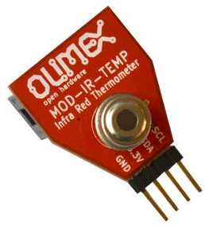
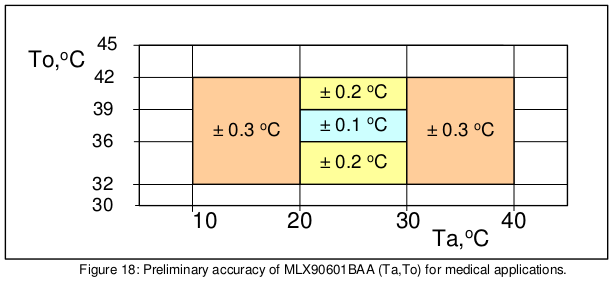
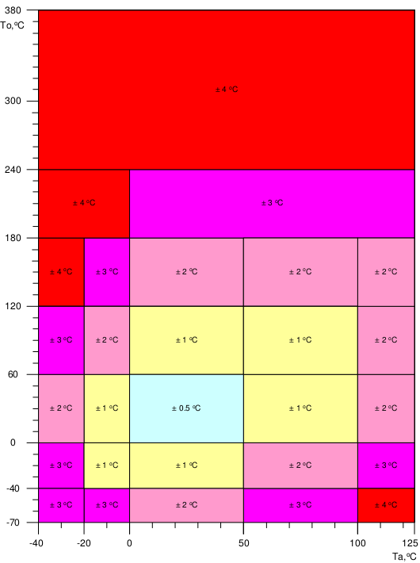
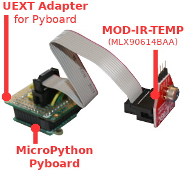
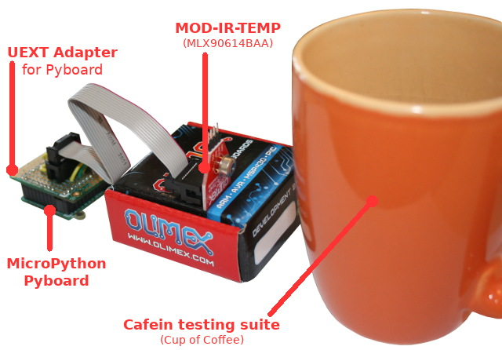

[This file exists also in ENGLISH](readme_ENG.md)

# Mesurer la température avec un capteur infrarouge sans contact

MOD-IR-TEMP est un thermomètre infrarouge basé sur le composant MLX90614BAA de Melexis.



Le MLX90614BAA est un capteur pour une très large gamme de température, capteur calibré en usine:
* -40 à 125 °C for sensor temperature and
* -70 à 380 °C for object temperature.
* La version BAA est destiné aux applications médicales et offre une résolution de 0.02°C (dans la gamme de température corporel).

Le MLX90614BAA offre la précision suivante dans la précision suivante dans la gamme de température "médicale".



La précision dépend également de la température mesurée, ce que démontre le diagramme suivant:



# Raccordement

Dans cet exemple, le MOD-IR-TEMP à simplement été branché sur le connecteur UEXT de la carte MicroPython Pyboard. Mais il pourrait tout aussi bien être branché sur une carte ESP8266-EVB d'Olimex.



## Port UEXT

Le branchement d'un port UEXT sur un ESP8266 est décrit dans le [répertoire UEXT](../UEXT/readme.md) de ce GitHub.

L' [adaptateur UEXT pour MicroPython Pyboard](https://github.com/mchobby/pyboard-driver/tree/master/UEXT) est également disponible dans le GitHub [Pyboard-Driver](https://github.com/mchobby/pyboard-driver) .

# Tester
Pour tester le capteur, il est nécessaire de copier le fichier `mlx90614.py` (le pilote) et le script de test `mlxtest.py` sur votre carte MicroPython.

Ensuite, la commande `import mlxtest` saissie dans une session REPL permet de lancer le script de test à la volée.



Ce qui produit le résultat suivant lorsque la tasse de café (avec du café chaud) est présenté devant le capteur:

```
raw_values (Ambiant, Object) (24.25, 24.95001)
Ambiant T°: 24.250 C   ->  Température ambiante
Object  T°: 24.950 C   ->  Température de l'objet (il n'y en a pas dans le cas présent)

Ambiant T°     Object  T°    
24.250 C        24.950 C       
24.270 C        24.990 C       
24.210 C        24.930 C   
... placer la tasse de café en face du capteur
24.990 C        39.670 C       
24.990 C        39.830 C       
25.010 C        39.990 C       
24.990 C        40.090 C       
24.990 C        40.010 C       
24.990 C        40.130 C       
24.990 C        40.130 C       
25.010 C        39.910 C       
24.990 C        39.890 C       
24.970 C        39.950 C       
24.970 C        39.990 C
```

# Où acheter
* Shop: UEXT Module MOD-IR-TEMP (to be defined)
* Shop: [Module WiFi ESP8266 - carte d'évaluation (ESP8266-EVB)](http://shop.mchobby.be/product.php?id_product=668)
* Shop: [UEXT Splitter](http://shop.mchobby.be/product.php?id_product=1412)
* Shop: [Câble console](http://shop.mchobby.be/product.php?id_product=144)
* Shop: [UEXT Module MOD-IR-TEMP](https://www.olimex.com/Products/Modules/Sensors/MOD-IR-TEMP/open-source-hardware) @ OLIMEX
