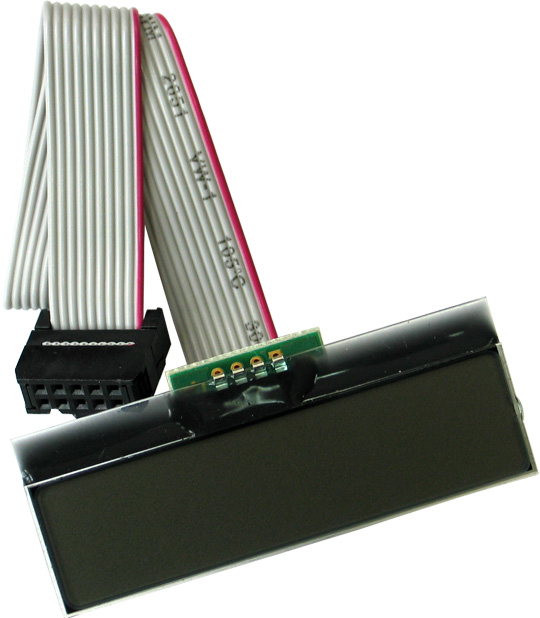
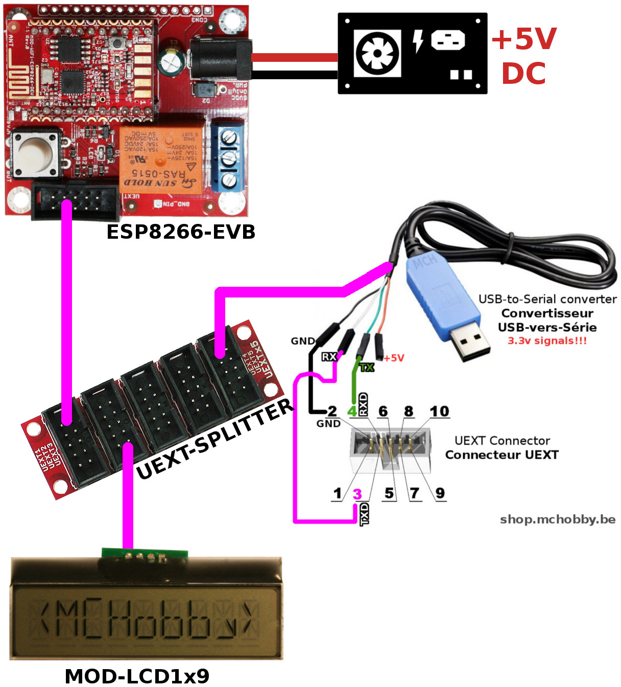
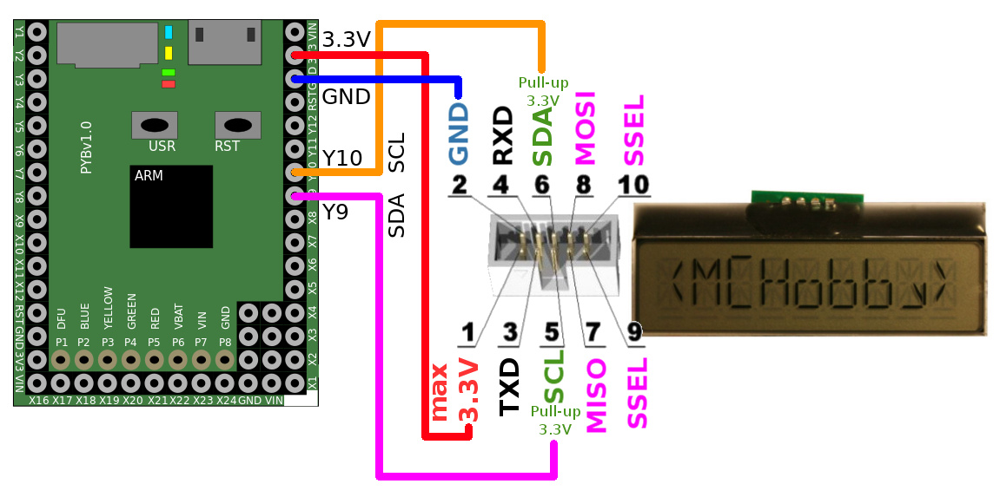

# Utiliser un MOD-LCD1x9 d'Olimex avec sous MicroPython

MOD-LCD1x9 est un afficheur LCD Alphanumerique 9 position d'Olimex utilisant le port UEXT.




Cette carte expose
* Utilise le Bus I2C
* Propose un point décimal pour chaque caractère
* Propose une barre de sélection (Under Barre) en dessous de chaque caractère (pratique pour indiquer la sélection d'une option).
* Un connecteur UEXT pour faciliter le raccordement

La bibliothèque MicroPython `modlcd19.py` permet de manipuler les points et les barre de sélections de l'afficheur, ce que ne permet pas la bibliothèque Arduino originale :-)

# ESP8266-EVB / Pyboard sous MicroPython
Avant de se lancer dans l'utilisation du module LCD sous MicroPython, il faudra flasher votre ESP8266 en MicroPython ou avec votre carte MicroPython Pyboard

Nous vous recommandons la lecture du tutoriel [ESP8266-EVB](https://wiki.mchobby.be/index.php?title=ESP8266-DEV) sur le wiki de MCHobby.

Ce dernier explique [comment flasher votre carte ESP8266 avec un câble console](https://wiki.mchobby.be/index.php?title=ESP8266-DEV).

## Port UEXT

Sur la carte ESP8266-EVB, le port UEXT transport le port série, bus SPI et bus I2C. La correspondance avec les GPIO de l'ESP8266 sont les suivantes.


# Brancher
## MOD-LCD1x9 sur ESP8266-EVB

Pour commencer, j'utilise un [UEXT Splitter](http://shop.mchobby.be/product.php?id_product=1412) pour dupliquer le port UEXT. J'ai en effet besoin de raccorder à la fois le câble console pour communiquer avec l'ESP8266 en REPL __et__ raccorder le module MOD-LCD1x9



## MOD-LCD1x9 sur Pyboard

Si vous diposez d'une [carte d'interface UEXT pour Pyboard](https://github.com/mchobby/pyboard-driver/tree/master/UEXT) alors le raccordement est totalement trivial.

Sinon, il est possible de réaliser les quelques raccordements suivants:



# Tester

## Bibliothèque modlcd19

Avant d'utiliser le script d'exemple, il est nécessaire de transférer la __bibliothèque modlcd19__ sur votre carte micropython.
* Copiez le fichier `modlcd19.py` sur la carte micropython.

Vous pouvez également transférer le script de test `test.py` sur la carte PyBoard. Les fichiers `testflt.py` et `testint.py` permettent respectivement d'afficher des valeurs décimales et des valeurs entières (avec justification à droite).   

La bibliothèque offre les fonctionalités suivantes:

__Membres:__
* Aucun

__Methodes:__
* `write`  : Afficher une valeur texte, float ou int sur le LCD. Voir détails plus loin.
* `point`  : Active un point sur la matrice (`position` de 1 à 9, `enable` True/False/None). Il est possible de forcer immédiatement la mise-à-jour du LCD avec `force_update`=True.
* `selection` : Active la barre de sélection (celle près du bord inférieur) sur l'afficheur. Comme pour `point` le paramètre `enable` True/False permet activer l'élément et `force_update` permet de forcer la m-à-j de l'écran.
* `update` : Force l'envoi du buffer des le LCD. Normalement, vous ne devriez pas avoir besoin d'appeler cet méthode.

__Methode write:__
`write( value, format=None, scrool_time=0.350 )`

Afficher une valeur sur le LCD.
* `value` est une String: Si la chaîne fait moins de 9 caractères, elle est simplement affichée. Si elle fait plus de 9 caractères, un scrolling est automatiquement mis en place (avec scrool_time pour chaque nouveau caractère affiché).
* `value` est un Float ou Int: Automatiquement alignés à droite! le paramètre `format` permet de spécifier le format d'affichage à utiliser.
* `format`: appliquer un format d'affichage à la valeur.

Par exemple:
 * lcd.write( 12.4693, format='%.3f v' ) -> avec 3 decimals -> "12.469 v"
 * lcd.write( 12.13, '%5d' ) -> affiche un Float comme un entier -> "   12"

## Exemple avec MOD-LCD1x9
```
# Utilisation du MOD-LCD1x9 d'Olimex avec un ESP8266 sous MicroPython
#
# Shop: [UEXT LCD1x9 board (MOD-RGB)](http://shop.mchobby.be/product.php?id_product=1414)
# Wiki: https://wiki.mchobby.be/index.php?title=MICROPYTHON-MOD-LCD1x9

from machine import I2C, Pin
from time import sleep
from modlcd19 import MODLCD1x9

# ESP8266-EVB
i2c = I2C( sda=Pin(2), scl=Pin(4) )
# PyBoard
# i2c = I2C(2)
lcd = MODLCD1x9( i2c ) # Activer tous les segments

# Afficher avec 9 caractères Max
lcd.write( '123456789' )
sleep( 2 )
lcd.write( '<mchobby>' )
sleep( 2 )

# Afficher une longue chaine de caractère
lcd.write( 'Hey, this is a message from Belgium' )

# Activate a point
lcd.write( 'ABCDEFGHI')
for i in range( 9 ):
	lcd.point( i+1, True, force_update=True )
	sleep( 1 )
	lcd.point( i+1, False, force_update=True )

sleep( 1 )

# Activate the selection
for i in range( 9 ):
	lcd.selection( i+1, True, force_update=True )
	sleep( 1 )
	lcd.selection( i+1, False, force_update=True )


lcd.write( 'The end.')
print( "That's the end folks")
```

## Exemple test Float
Contenu de l'exemple disponible dans le fichier `testflt.py`. Ce dernier démontre l'affichage de valeur avec décimale, aligner à droite et chaîne de formattage.

```
# Test the Olimex MOD-LCD1x9 board.
#
# Display float value (justified on the right)
from machine import I2C, Pin
from time import sleep
from modlcd19 import MODLCD1x9

# Esp8266-EVB
i2c = I2C( sda=Pin(2), scl=Pin(4) )
# PyBoard
# i2c = I2C(2)
lcd = MODLCD1x9( i2c ) # Activer tous les segments

# Afficher une valeur décimale
volt = 15.125
while True:
    volt = volt + 0.033
    # Afficher un float avec 3 décimales et un "v" pour volts
    # voir: https://docs.python.org/3/library/string.html#format-examples
    lcd.write( volt, format='%.3f v' )
    # Donner du temps pour au LCD pour se rafraîchir
    sleep( 0.100 )

print( "That's the end folks")
```

# Où acheter
* [UEXT Module MOD-LCD1x9](http://shop.mchobby.be/product.php?id_product=1414) @ MCHobby
* [UEXT Module MOD-LCD1x9](https://www.olimex.com/Products/Modules/LCD/MOD-LCD-1x9/open-source-hardware) @ Olimex
* [ESP8266-EVB: Module WiFi ESP8266 - carte d'évaluation](http://shop.mchobby.be/product.php?id_product=668) @ MCHobby
* [ESP8266-EVB](https://www.olimex.com/Products/IoT/ESP8266/ESP8266-EVB/open-source-hardware) @ Olimex
* [MicroPython Pyboard](https://shop.mchobby.be/fr/56-micropython) @ MCHobby
* [UEXT Splitter](http://shop.mchobby.be/product.php?id_product=1412) @ MCHobby
* [Câble console](http://shop.mchobby.be/product.php?id_product=144) @ MCHobby

* Wiki: https://wiki.mchobby.be/index.php?title=MICROPYTHON-MOD-LCD1x9
