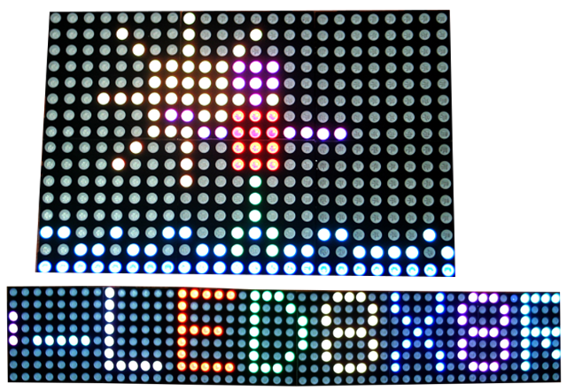
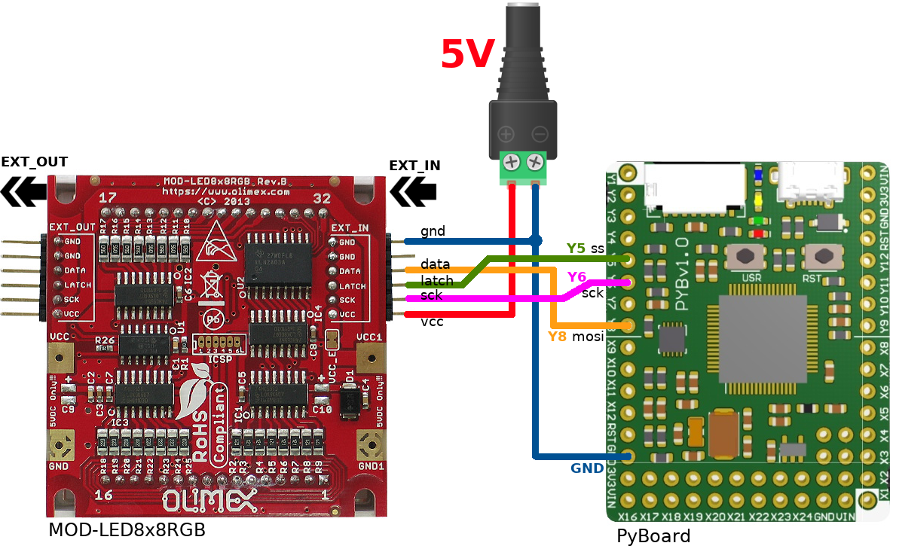
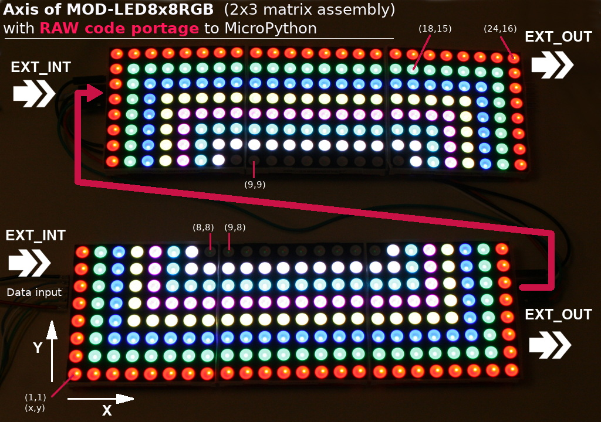
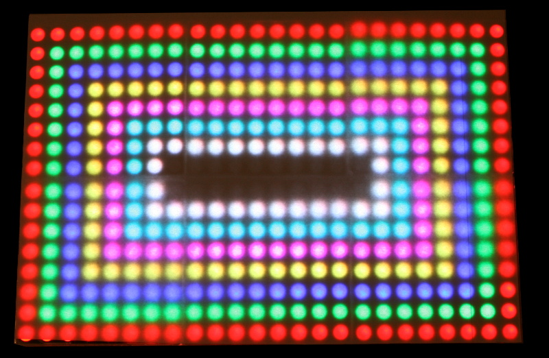

[Ce fichier existe également en FRANCAIS](readme.md)

# Create LED display with MOD-LED8x8RGB slabs


The __MOD-LED8x8RGB__ is an SPI based 8x8 LED module created by [Olimex](https://www.olimex.com).

The modules can be daisy chained to create digital signage or LED display with RGB LEDs (3 fundamental colors + combinations) slab or white leds slabs.



As described in the [datasheet](https://www.olimex.com/Products/Modules/LED/MOD-LED8x8RGB/open-source-hardware), the modules use a simple opensource protocol and __oneway SPI bus__.

The MOD-LED8x8RGB sit in UEXT category but does not expose the UEXT connector. Indeed the UEXT connector is replaced with a pinHeader suited for daysi chaining the slabs/matrix. By the way a simple conversion connector can easily be made (see further).

This board can be found:
* [MOD-LED8x8RGB](https://shop.mchobby.be/fr/138-uext) @ MCHobby
* [MOD-LED8x8RGB](https://www.olimex.com/Products/Modules/LED/MOD-LED8x8RGB/open-source-hardware) @ Olimex.com ncd.io

# FrameBuffer implementation

The ModLedRGB driver inherit from MicroPython's FrameBuffer class. So every method of FrameBuffer is available on ModLedRGB and the ModLedRGB can be given as FrameBuffer parameter to any function/method.

Please note that __AXIS of FrameBuffer implementation__ is different than RAW/Arduino original implementation!

The FrameBuffer axis are positionned as follow with FrameBuffer:


For a single matrix, the ModLedRGB instance is created as follows:
```
modled = ModLedRGB( spi, ss ) # Just one LED brick LED-8x8RGB
```

The matrix can be daisy chained with the following scheme


With this 2 row of 3 columns matrix assembly, the ModLedRGB instance is created as follows:
```
modled =  ModLedRGB( spi, ss, width=3, height=2 ) # 6x LED-8x8RGB
```

# Wiring

## MOD-LED8x8RGB to UEXT adapter
Here is a simple connector cable to connect the MOD-LED8x8RGB to any UEXT host port.


## Port UEXT
If you have the adapter described here above then you can une the UEXT connector of your favorite plateforme.

* The wiring of an UEXT Port on ESP8266 is described in the [UEXT folder](../UEXT/readme_eng.md) of this GitHub.
* The [UEXT adapter for MicroPython Pyboard](https://github.com/mchobby/pyboard-driver/tree/master/UEXT) is also available in the [Pyboard-Driver](https://github.com/mchobby/pyboard-driver) GitHub.

## Direct Wiring on Pyboard
A direct wiring to a Pyboard have also been made while experimenting the MOD-LED8x8RGB so here it is!



_Note: this wiring is fully compatible with the [UEXT adapter for MicroPython Pyboard](https://github.com/mchobby/pyboard-driver/tree/master/UEXT)_

# Testing

## Test with FrameBuffer
MicroPython offer a FrameBuffer to manage the data for the displays.

The `ModLedRGB` driver (modled.py) have been developped against the FrameBuffer and will, then, take all the advantage of FrameBuffer manipulations (line drawing, text displaying, etc).

## library & examples

Copy the library file `modled.py` and the test file `test.py` on your MicroPython board.

The `test.py` file (listed here under) can be loaded from REPL session with `import test`.

```
from machine import Pin, SPI
from modled import *

# Initialize the SPI Bus (on ESP8266-EVB)
# Software SPI
#    spi = SPI(-1, baudrate=4000000, polarity=1, phase=0, sck=Pin(14), mosi=Pin(13), miso=Pin(12))
# Hardware SPI on Pyboard
spi = SPI(2) # MOSI=Y8, MISO=Y7, SCK=Y6, SS=Y5
spi.init( baudrate=2000000, phase=0, polarity=0 ) # low @ 2 MHz
# We must manage the SS signal ourself
ss = Pin( Pin.board.Y5, Pin.OUT )

modled = ModLedRGB( spi, ss ) # Just one LED brick LED-8x8RGB

modled.rect(0,0,8,8,RED) #x,y, width, Height
modled.rect(1,1,6,6,GREEN)
modled.rect(2,2,4,4,BLUE)
modled.rect(3,3,2,2,MAGENTA)
modled.show()
```

which produce the following result


The second example use a combination of 6 matrixes

```
from machine import Pin, SPI
from modled import *

# Hardware SPI on Pyboard
spi = SPI(2) # MOSI=Y8, MISO=Y7, SCK=Y6, SS=Y5
spi.init( baudrate=2000000, phase=0, polarity=0 ) # low @ 2 MHz
# We must manage the SS signal ourself
ss = Pin( Pin.board.Y5, Pin.OUT )

modled = ModLedRGB( spi, ss, width=3, height=2 )

modled.fill_rect(0,0,8,8,RED)
modled.fill_rect(8,0,8,8,GREEN)
modled.fill_rect(16,0,8,8,BLUE)
modled.fill_rect(0,8,8,8,BLUE)
modled.fill_rect(8,8,8,8,GREEN)
modled.fill_rect(16,8,8,8,RED)
modled.show()
time.sleep( 2 )

# See what's inside the FrameBuffer memory
# modled._dump()

colors = [ RED, GREEN, BLUE, YELLOW, MAGENTA, CYAN, WHITE, BLACK ]
for color in colors:
	y, y_sign = 0, 1
	for x in range( modled.pixels[0] ): # PixelWidth
		modled.clear()
		modled.vline( x, 0, modled.pixels[1], color )
		modled.hline( 0, y, modled.pixels[0], color )
		y += y_sign
		if (y >= modled.pixels[1]) or (y<0):
			y_sign *= -1
			if y<0:
				y = 0
			else:
				y = modled.pixels[1]-1 # Height
		modled.show()
		time.sleep(0.050)

# plot points
modled.clear()
modled.pixel( 2,2, GREEN ) # Green
modled.pixel( 3,3, BLUE ) # Blue
modled.pixel( 4,6, YELLOW ) # Red + Green = Yellow
modled.pixel( 7,6, MAGENTA ) # Red + Blue  = Magenta
modled.pixel( 8,5, CYAN ) # Green + Blue  = Cyan
modled.pixel( 9,4, WHITE ) # Red + Green + Blue  = White
modled.text( "MCH",0,8,MAGENTA) # 8x8 px font

modled.show()
```
which produce the following result:


# RAW Driver testing

__Warning: the RAW driver does use different axis model herited from Arduino code.__


## Test with RAW driver
The initial port of Arduino driver to MicroPython was done with the _video buffer_ suggested by Olimex in the orginal code ( `self.buffer = [0]*self.matrixes*24` ).

The `ModLedRGBraw` driver (examples/modledraw.py) only implement pixel drawing for testing the protocol before switching to FrameBuffer implementation.

The final FrameBuffer driver, the suited version to use, will be made available in the `modled/modled.py` file.

## RAW library & examples
The raw library was for testing only and not designed for regular usage.

Copy the library file `examples/modledraw.py` and the test file `examples/testraw.py` on your MicroPython board.

The `testraw.py` file (listed here under) can be loaded from REPL session with `import testraw`.

```
# ----------------------------------------------
#   DO NOT USE RAW driver
#   USE the FrameBuffer driver (here upper)
# ----------------------------------------------

from machine import Pin, SPI
from modledraw import ModLedRGBraw

# Initialize the SPI Bus (on ESP8266-EVB)
# Software SPI
#    spi = SPI(-1, baudrate=4000000, polarity=1, phase=0, sck=Pin(14), mosi=Pin(13), miso=Pin(12))
# Hardware SPI on Pyboard
spi = SPI(2) # MOSI=Y8, MISO=Y7, SCK=Y6, SS=Y5
spi.init( baudrate=2000000, phase=0, polarity=0 ) # low @ 2 MHz
# We must manage the SS signal ourself
ss = Pin( Pin.board.Y5, Pin.OUT )

modled = ModLedRGBraw( spi, ss ) # Just one LED brick LED-8x8RGB
modled.drawPixel( 1,1, color=1 ) # Red
modled.drawPixel( 2,2, color=2 ) # Green
modled.drawPixel( 3,3, color=4 ) # Blue
modled.drawPixel( 4,8, color=3 ) # Red + Green = Yellow
modled.drawPixel( 5,8, color=5 ) # Red + Blue  = Magenta
modled.drawPixel( 6,7, color=6 ) # Green + Blue  = Cyan
modled.drawPixel( 7,6, color=7 ) # Red + Green + Blue  = White
modled.show()
```

which produce the following result (with axis reference) :


The `examples/testraw2x3.py` test script explore the matrix chaining (2 rows, 3 columns).



Which produce a really nice result under a sheet of paper (otherwise there is too much light for the camera).


