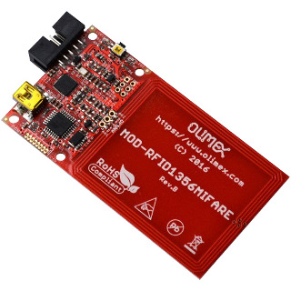
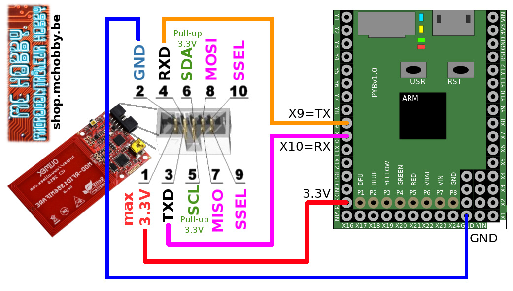

[Ce fichier existe également en FRANCAIS ici](readme.md)

# Using the MOD-RFID1536 from Olimex to read (and write) MiFare/RFID tags

This library offer `RFID_READER` class to drive the MOD-RFID1536MiFare RFID scanner.



That RFID scanner offers 3 interface:
* USB-HID keyboard (to work like a keyboard)
* USB-CDC (or USB-Serial) to offer a serial interface over USB (nice for computer)
* UART (on UEXT) which offer serial interface for microcontrolers.

The protocol used by the MOD-RFID1536 is detailled [here on the Olimex's Wiki](https://www.olimex.com/wiki/MOD-RFID1356MIFARE).

For more information, please check this [product sheet](http://shop.mchobby.be/product.php?id_product=1619) or [Olimex's product sheet](https://www.olimex.com/Products/Modules/RFID/MOD-RFID1356MIFARE/).

## Configure to enter the UART mode
* Press (and keep it down) the user button.
* The LED with start blinking in the following patterns (3 sec each pattern). Red=Keyboard, Green=USB-Serial, Red+Green=uart
* When the UART mode (red+green blinking) is active then release the button to select that mode.

## Configure Authentication Keys
Configuring the board through UART is not always reliable with former revision of the firmware (eg: i'm using 2.1.8 firmware).

I strongly recommend to switch to the USB-CDC (Usb-Serial) mode and use Putty to fix the authentication key (they are stored in the EEPROM).

On brand new MiFare (NTAG203 chip), the authentication key A is 0xFFFFFFFFFFFF.

Set it with the following serial commands to set the Key A and use it as working key:
```
ka,FFFFFFFFFFFF
mka
```
The current key in used can be checked with the command `k?`.

# Wiring
If you have an [UEXT Interface on your Pyboard](https://github.com/mchobby/pyboard-driver/tree/master/UEXT) then you just plug the MOD-RFID1536MiFare with an IDC cable.

Otherwise, you can also use the following Wiring:



# Test
The library `modrfid.py` contains the class `RFID_READER` that will help to deal with the board.

## Basic test script
The simplier example `simpletest.py` will read the incoming TAG (just their UID).

The `update()` methode must be called as often as possible since it make all the heavy part of listening to the serial port and parsing the incoming data.

``` python
from machine import UART
from modrfid import RFID_READER

uart = UART( 1, baudrate=38400, timeout=500 )
rfid = RFID_READER( uart, debug=False)
rfid.eeprom_read( False ) # Do not read EEPROM data

# Display MOD-RFID1536MIFARE firmware version to Output
lines = rfid.reader_info()
for line in lines:
	print( line )

print("Please scan RFID cards")
while True:
	rfid.update()
	if rfid.has_card:
		print( "Card detected: %s" % rfid.card_id )
		# Cleat the card data
		rfid.clear()

```

## Advanced feature
This second script `blockread.py` is a bit mode advance. After some configuration instructions, it read the incoming card and one (or more) data block from EEPROM.

As the RFID_READER is configured to read EEPROM with `rfid.eeprom_read( True )`
then the `update()` method does an extra-job to load the blocks send after the UID on the serial line.

``` python
from machine import UART
from modrfid import RFID_READER, DEFAULT_AUTH_KEY
from time import sleep

uart = UART( 1, baudrate=38400, timeout=500 )
rfid = RFID_READER( uart, debug=False)

key_a = rfid.get_key( 'a' )
print( 'Key A = %s' % key_a )

# Code below is not reliable AT ALL and cause ERR: if not in debug mode
# Key A have been fixed by using the USB-CDC support.
#if key_a != '112233445566':
#	print( 'Change the key A...')
#	rfid.set_key( 'a', '112233445566' )

# Which if the current working key
current_key, current_key_value = rfid.get_work_key()
print( "Current working Key is %s with key=%s" % (current_key, current_key_value) )
if current_key != 'a':
	print('Set current work key to a')
	rfid.set_work_key( 'a' )

key_b = rfid.get_key( 'b' )
print( 'Key B = %s' % key_b )

# We want to read EEPROM block 0 (manufacturer block) together with the CARD ID
# Can have up to 64 block
rfid.read_blocks( 0 )

# activate eeprom block reading
rfid.eeprom_read( True )

print("Please scan RFID card")
while True:
	try:
		rfid.update()

		if rfid.has_card:
			print( "Card detected: %s" % rfid.card_id )

		if rfid.has_blocks:
			print( 'EEPROM blocks')
			# rfid.blocks is a dictionnary
			for block_nr, block_data in rfid.blocks.items():
				print( "  blocks % s : %s" % (block_nr, block_data) )

		if rfid.has_card:
			# Something has been read so now...
			# Clear the captured data
			rfid.clear()
	except Exception as err:
		print( '[ERROR] %s' % err )
		print( '[ERROR] LastError = %s' % rfid.last_error )
```

which displays the following data (block 0 is the manufacturer block). The data in the block is ready to be transformed as binary data with the help of `binascii.unhexlify()`.

```
Card detected: 56F6637E
EEPROM blocks
  blocks 0 : 56F6637EBD08040001A8797EC7E2191D

Card detected: 76FBAF7C
EEPROM blocks
  blocks 0 : 76FBAF7C5E0804000153CA346B0F8C1D
```

# Shopping list
* [MOD-RFID1536Mifare](http://shop.mchobby.be/product.php?id_product=1619) @ MCHobby
* [MOD-RFID1536Mifare](https://www.olimex.com/Products/Modules/RFID/MOD-RFID1356MIFARE/) @ Olimex.
* [MicroPython Pyboard](http://shop.mchobby.be/product.php?id_product=570) @ MCHobby
