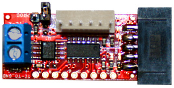
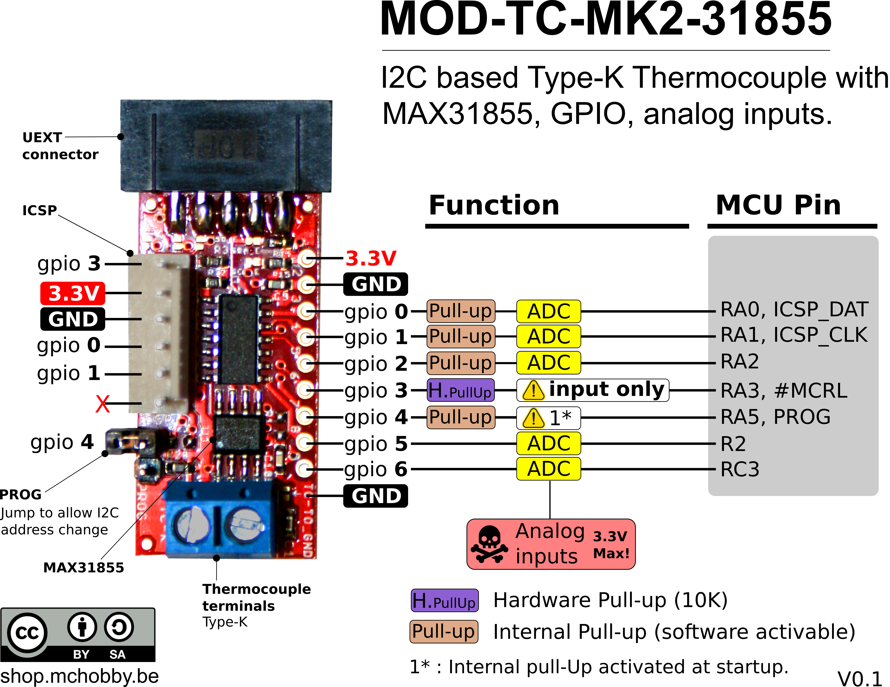

[Ce fichier existe également en FRANCAIS](readme.md)

# Use a Type-K thermocouple via I2C (and MAX31855) under MicroPython

The __MOD-TC-MK2-31855__ from Olimex is not only a MAX31855 thermocouple amplifier but also a PIC16F1503 microcontroler allowing to capture the thermocouple temperature over the I2C bus.



The module also offers 7 GPIOs also available via the I2C bus. You can manage the GPIOs as digital input or output or as analog input (10 bits resolution).

 

The interest of `modtc_mk2.py` MicroPython library is to offer the acces to all the pin behaviours via the GPIO number.

# Wiring

To wire the board, just plug it onto an UEXT connector.

You can make your own [UEXT breakout for Pyboard](https://github.com/mchobby/pyboard-driver/tree/master/UEXT) to facilitate the connexion of UEXT board on your Pyboard.


You can also connect the MOD-TC module via the [PYBOARD-UNO-R3](https://github.com/mchobby/pyboard-driver/tree/master/UNO-R3) adapter which also expose a UEXT connector.

# Test

The `modtc_mk2.py` library will be required on the MicroPython board to run the various example file.

## Read temperature

``` python
from machine import I2C
from modtc_mk2 import MODTC_MK2

# PYBOARD-UNO-R3 & UEXT for Pyboard. SCL=Y9, SDA=Y10
i2c = I2C(2)
mk2 = MODTC_MK2( i2c )

# Internal & External temperatures
temp_in, temp_ext = mk2.temperatures
# display
print( "Internal Temp = %s" % temp_in )
print( "External Temp = %s" % temp_ext )
```

## Analog input

The board allows analog reading on the GPIOs 0,1,2,5,6.

The `test_analog.py` script read all the analog pins every second.

``` python
from machine import I2C
from modtc_mk2 import MODTC_MK2

# PYBOARD-UNO-R3 & UEXT for Pyboard. SCL=Y9, SDA=Y10
i2c = I2C(2)
mk2 = MODTC_MK2( i2c )

for pin in [0,1,2,5,6]: # PinNumber with Analog support
	value = mk2.analog_read( pin ) # 10 bits reading
	volts = value / 1023 * 3.3 # Voltage
	print( "Analog %s = %3.2f v (%4i)" % (pin,volts,value ) )
```

Which produce the following results:

```
Analog 0 = 0.63 v ( 194)
Analog 1 = 0.35 v ( 109)
Analog 2 = 0.16 v (  51)
Analog 5 = 1.53 v ( 474)
Analog 6 = 1.34 v ( 416)
```

## Input with Pullup

``` python
from machine import I2C, Pin
from modtc_mk2 import MODTC_MK2
from time import sleep 

# PYBOARD-UNO-R3 & UEXT for Pyboard. SCL=Y9, SDA=Y10
i2c = I2C(2)
mk2 = MODTC_MK2( i2c )

print( "Config GPIO 2 as input with Pull-up" )
mk2.pin_mode( 2, Pin.IN )
mk2.pullup( 2, True  )
while True:
	print( "GPIO 2 : %s" % ("3.3v" if mk2.digital_read(2) else "Gnd") )
	sleep( 1 )
```

Ce qui produit:

```
MicroPython v1.11-473-g86090de on 2019-11-15; PYBv1.1 with STM32F405RG
Type "help()" for more information.
>>>
>>> import test_pullup
Config GPIO 2 en entree avec Pull-up
GPIO 2 : 3.3v
GPIO 2 : 3.3v
GPIO 2 : 3.3v
GPIO 2 : 3.3v
GPIO 2 : 3.3v
GPIO 2 : Gnd
GPIO 2 : Gnd
GPIO 2 : 3.3v
```

## Digital output

``` python
from machine import I2C, Pin
from modtc_mk2 import MODTC_MK2
from time import sleep

# PYBOARD-UNO-R3 & UEXT for Pyboard. SCL=Y9, SDA=Y10
i2c = I2C(2)
mk2 = MODTC_MK2( i2c )

# the GPIO to test
GPIO = 6

print( "Toggle the GPIO %s state" % GPIO )
mk2.pin_mode( GPIO, Pin.OUT )
while True:
	print( "ON" )
	mk2.digital_write( GPIO, True )
	sleep( 1 )
	print( "off" )
	mk2.digital_write( GPIO, False )
	sleep( 1 )
```

## Change the module's I2C address

The I2C address of the MOD-TC-MK2-31855 module is stored inside the microcontroleur's EEPROM.

This make it possible to change the module's address on the bus (with the appropriate I2C command, command support by the `modtc_mk2.py` library).

Thank the the address change, it is possible to have multiple MOD-TC-MK2-31855 module on a same I2C bus.

``` python
from machine import I2C
from modtc_mk2 import MODTC_MK2

FROM_ADDRESS = 0x23 # 0x23 is the default address of MOD-TC-MK2-31855
TO_ADDRESS   = 0x25

# PYBOARD-UNO-R3 & UEXT for Pyboard. SCL=Y9, SDA=Y10
i2c = I2C(2)

print( "I2C scan..." )
print( ", ".join( [ "0x%x" % value for value in i2c.scan() ] ))
print( "" )

print( "Connecting to address 0x%x" % FROM_ADDRESS )
mk2 = MODTC_MK2( i2c, address=FROM_ADDRESS )

print( "Change to address 0x%x" % TO_ADDRESS )
mk2.change_address( new_address=TO_ADDRESS )

print( "Power cycle the board and make")
print( "a new I2C scan to check the address." )
```

## Read from many modules

By using several MOD-TC-MK2-31855 modules (each having its own address on the bus), it is possible to request the data of each module (each one after the other).

In the following example, the modules are availables at adresses 0x23 and 0x25.

``` python
from machine import I2C
from modtc_mk2 import MODTC_MK2
from time import sleep

# The two modules address
MK2_ADDR_1 = 0x23
MK2_ADDR_2 = 0x25

# PYBOARD-UNO-R3 & UEXT for Pyboard. SCL=Y9, SDA=Y10
i2c = I2C(2)
mk_dic = { 'temp 1' : MODTC_MK2( i2c, address=MK2_ADDR_1 ),
		   'temp 2' : MODTC_MK2( i2c, address=MK2_ADDR_2 )   }

while True:
	print( "-"*40 )
	for name, mk2 in mk_dic.items():
		temp = mk2.temperatures[1]
		print( "%s : %5.2f C" % (name, temp) )
	sleep(1)
```

Which produce the following result:

``` python
MicroPython v1.11-473-g86090de on 2019-11-15; PYBv1.1 with STM32F405RG
Type "help()" for more information.
>>>
>>> import test_dual
----------------------------------------
temp 1 : 21.00 C
temp 2 : 22.25 C
----------------------------------------
temp 1 : 21.00 C
temp 2 : 22.25 C
----------------------------------------
temp 1 : 20.75 C
temp 2 : 21.75 C
----------------------------------------
temp 1 : 21.00 C
temp 2 : 21.50 C
```

# Shopping list
* [MicroPython board](https://shop.mchobby.be/fr/56-micropython) @ MCHobby
* [MOD-TC-MK2-31855 with MAX31855](https://shop.mchobby.be/fr/nouveaute/1624-mod-tc-mk2-31855-interface-thermocouple-type-k-avec-max31855-bus-i2c-gpio-3232100016248-olimex.html) @ MCHobby
* [MOD-TC-MK2-31855 with MAX31855](https://www.olimex.com/Products/Modules/Sensors/MOD-TC-MK2-31855/open-source-hardware) @ Olimex
