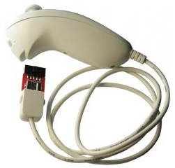
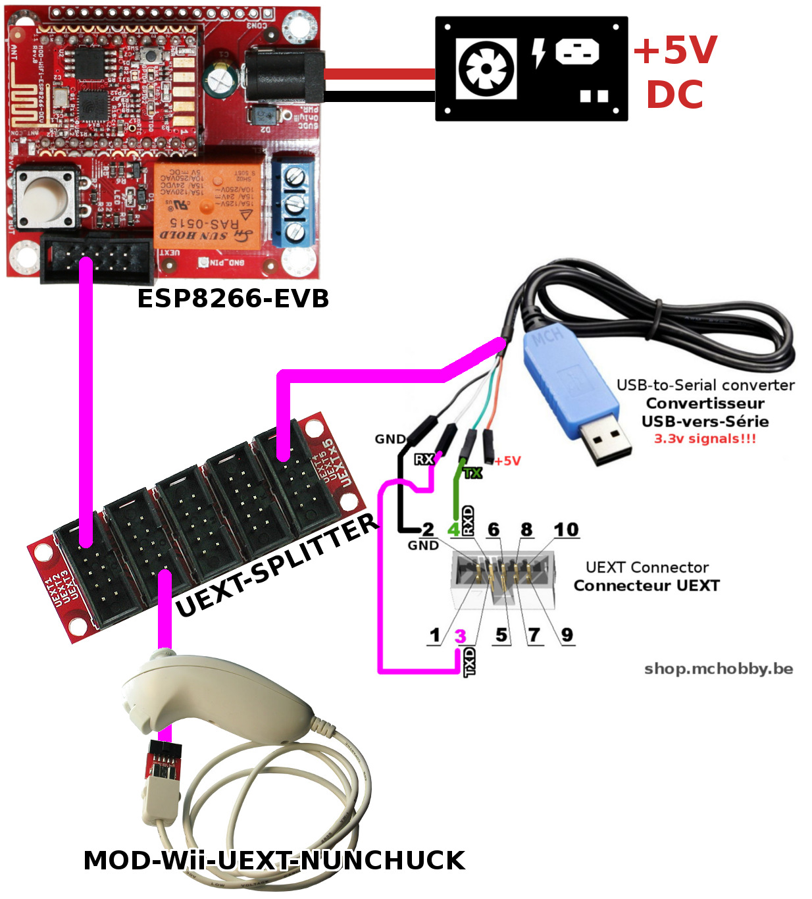

# Use an Olimex MOD-Wii-UEXT-NUNCHUCK with ESP8266 under MicroPython

La WII NUNCHUCK est un controleur de jeu pour la console Wii.

Ce controleur I2C est équipé d'un connectueur I2C pour faciliter les branchements.



Ce contrôleur dispose.
* Accéléromètre 3-axes
* Joystick analogique X-Y
* Deux buttons C et Z
* __Interface I2C__
* Connecteur UEXT

__Où acheter__
* Shop: [Controleur Wii Nunchuck UEXT (MOD-Wii-UEXT-NUNCHUCK)](http://shop.mchobby.be/product.php?id_product=1416)
* Shop: [Module WiFi ESP8266 - carte d'évaluation (ESP8266-EVB)](http://shop.mchobby.be/product.php?id_product=668)
* Shop: [UEXT Splitter](http://shop.mchobby.be/product.php?id_product=1412)
* Shop: [Câble console](http://shop.mchobby.be/product.php?id_product=144)
* Wiki: https://wiki.mchobby.be/index.php?title=MICROPYTHON-MOD-WII-NUNCHUCK

# ESP8266-EVB sous MicroPython
Avant de se lancer dans l'utilisation du module MOD-IO sous MicroPython, il faudra flasher votre ESP8266 en MicroPython.

Nous vous recommandons la lecture du tutoriel [ESP8266-EVB](https://wiki.mchobby.be/index.php?title=ESP8266-DEV) sur le wiki de MCHobby.

Ce dernier explique [comment flasher votre carte ESP8266 avec un câble console](https://wiki.mchobby.be/index.php?title=ESP8266-DEV).

## Port UEXT

Sur la carte ESP8266-EVB, le port UEXT transport le port série, bus SPI et bus I2C. La correspondance avec les GPIO de l'ESP8266 sont les suivantes.


# Brancher

## ESP8266-EVB (Olimex)
Pour commencer, j'utilise un [UEXT Splitter](http://shop.mchobby.be/product.php?id_product=1412) pour dupliquer le port UEXT. J'ai en effet besoin de raccorder à la fois le câble console pour communiquer avec l'ESP8266 en REPL __et__ raccorder le module MOD-RGB



## MicroPython Pyboard

Pour le brancher facilement sur une Pyboard, le plus simple est de préparer un connecteur UEXT Mâle raccordé sur la Pyboard puis de connecter la Nunchuck dessus.


# Bibliothèque

Avant d'utiliser le script d'exemple, il est nécessaire de transférer la __bibliothèque `wiichuck.py`__ sur votre carte micropython.

* Copiez le fichier `testtest.py` sur la carte micropython.
* Copiez le fichier `testcount.py` sur la carte micropython.
* Copiez le fichier `testacc.py` sur la carte micropython.

La bibliothèque offre les fonctionnalités suivantes

__Membres:__
* `c`  : True/False, indique si le bouton C est actuellement enfoncé.
* `z`  : True/False, indique si le bouton Z est actuellement enfoncé.
* `c_count` : indique le nombre de pression sur le bouton C depuis le dernier appel à `c_count`. Réinitialize la valeur à 0. Le nombre de pression détectable dépend de la fréquence d'appel de la méthode `update()`.
* `z_count` : indique le nombre de pression sur le bouton Z depuis le dernier appel à `z_count`. Réinitialize la valeur à 0. Le nombre de pression détectable dépend de la fréquence d'appel de la méthode `update()`.
*  `joy_x`  : retourne la position de l'axe X du joystick. Entier entre -128 (gauche) et +128 (droite)
*  `joy_y`  : retourne la position de l'axe Y du joystick. Entier entre -128 (arrière) et +128 (avant)
* `joy_right`  : Indique si le joystick est poussé sur la droite (au delà d'un seuil minimum).
* `joy_left`  : Indique si le joystick est poussé sur la gauche (au delà d'un seuil minimum).
* `joy_up`  : Indique si le joystick est poussé vers l'avant (au delà d'un seuil minimum).
* `joy_down` : Indique si le joystick est tiré vers l'arrière (au delà d'un seuil minimum).
* `accel_x`  : Lit la valeur de l'accéléromètre, axe X.
* `accel_y`  : Lit la valeur de l'accéléromètre, axe Y.
* `accel_z`  : Lit la valeur de l'accéléromètre, axe Z.
* `roll`  : indique l'angle de roulage (rool, en degrés) de la manette. Penchée sur la gauche ou la droite en faisant rouler le poignet.
* `pitch`  : indique l'angle "pitch", manette abaissée ou relevée en même temps que l'avant bras.

__Methodes:__
* `update()`   : a appeler pour récupérer les informations de la Wii Nunchuck. Information disponible sur les différentes propriétés.

# Tester
## Exemple lecture bouton et Joystick
```
# Test the Olimex MOD-Wii-UEXT-NUNCHUCK game controler.
#
# MOD-Wii-UEXT-NUNCHUCK : http://shop.mchobby.be/product.php?id_product=1416
# MOD-Wii-UEXT-NUNCHUCK : https://www.olimex.com/Products/Modules/Sensors/MOD-WII/MOD-Wii-UEXT-NUNCHUCK/  

from machine import I2C, Pin
from time import sleep_ms
from wiichuck import WiiChuck

# Pyboard
# i2c=I2C(2)
i2c = I2C( sda=Pin(2), scl=Pin(4) )
wii = WiiChuck( i2c ) # default address=0x58

while True:
	# Detect direction from boolean property
	direction = ''
	if wii.joy_up:
		direction = 'Up'
	elif wii.joy_down:
		direction = 'Down'
	elif wii.joy_right:
		direction = '>>>'
	elif wii.joy_left:
		direction = '<<<'

	print( "-"*20 )
	# Test button states
	print( "Button C: %s" % wii.c )
	print( "Button Z: %s" % wii.z )
	# print X, Y analog value + detected direction
	print( "Joy X, Y: %4d,%4d  (%s)" % (wii.joy_x, wii.joy_y, direction) )

	wii.update()
	sleep_ms( 150 )
```

Ce qui produit le résultat suivant:

```
Button C: False
Button Z: False
Joy X, Y:    0, 123  (Up)
--------------------
Button C: False
Button Z: False
Joy X, Y:    0, 123  (Up)
--------------------
Button C: False
Button Z: False
Joy X, Y:    0,  28  ()
--------------------
Button C: False
Button Z: False
Joy X, Y:    0,   0  ()
--------------------
Button C: False
Button Z: False
Joy X, Y:    0,  -3  ()
--------------------
Button C: False
Button Z: False
Joy X, Y:    3,-132  (Down)
--------------------
Button C: False
Button Z: False
Joy X, Y:    5,-132  (Down)
```

## Exemple compteurs de pression des boutons
Contenu de l'exemple disponible dans le fichier `testcount.py`.

Permet de compter le nombre de pression sur C et Z entre deux appels de `c_count()` et `z_count()`.

```
# Test the Olimex MOD-Wii-UEXT-NUNCHUCK game controler.
#
# MOD-Wii-UEXT-NUNCHUCK : http://shop.mchobby.be/product.php?id_product=1416
# MOD-Wii-UEXT-NUNCHUCK : https://www.olimex.com/Products/Modules/Sensors/MOD-WII/MOD-Wii-UEXT-NUNCHUCK/  

from machine import I2C, Pin
import time
from wiichuck import WiiChuck

# Pyboard
# i2c=I2C(2)
i2c = I2C( sda=Pin(2), scl=Pin(4) )
wii = WiiChuck( i2c ) # default address=0x58

dir_time   = time.time()
count_time = time.time()
while True:
	if time.time()-dir_time > 0.5:
		# Detect direction from boolean property
		direction = ''
		if wii.joy_up:
			direction = 'Up'
		elif wii.joy_down:
			direction = 'Down'
		elif wii.joy_right:
			direction = '>>>'
		elif wii.joy_left:
			direction = '<<<'
		print( "Joy direction : %s" % (direction) )
		dir_time = time.time()

	if time.time()-count_time > 2:
		# Test button states
		print( "C Button pressure count: %s" % wii.c_count )
		print( "Z Button pressure count: %s" % wii.z_count )
		count_time = time.time()

	wii.update()
	time.sleep_ms( 5 )
```

Ce qui produit le résultat suivant:

```
Joy direction : Up
C Button pressure count: 2
Z Button pressure count: 1
Joy direction :
Joy direction :
Joy direction : Down
C Button pressure count: 0
Z Button pressure count: 7
Joy direction : Down
Joy direction :
Joy direction :
C Button pressure count: 1
Z Button pressure count: 1
Joy direction :
Joy direction :
Joy direction :
C Button pressure count: 2
Z Button pressure count: 5
Joy direction :

```

## Exemple Accéléromètre
Contenu de l'exemple disponible dans le fichier `testacc.py`.

Affiche régulièrement les informations de l'accéléromètre et les angles 'pitch' et 'roll' en degrés.

```
# Test the Olimex MOD-Wii-UEXT-NUNCHUCK game controler.
#
# MOD-Wii-UEXT-NUNCHUCK : http://shop.mchobby.be/product.php?id_product=1416
# MOD-Wii-UEXT-NUNCHUCK : https://www.olimex.com/Products/Modules/Sensors/MOD-WII/MOD-Wii-UEXT-NUNCHUCK/  

from machine import I2C, Pin
import time
from wiichuck import WiiChuck

i2c = I2C( sda=Pin(2), scl=Pin(4) )
wii = WiiChuck( i2c ) # default address=0x58

acc_time   = time.time()
while True:
	if time.time()-acc_time > 0.5:
		print( '-'*20 )
		print( "Joy Accelerometer x,y,z  : %4d, %4d, %4d" % (wii.accel_x, wii.accel_y, wii.accel_z) )
		# https://www.novatel.com/solutions/attitude/
		# pitch = airplane nose up/down
		# roll  = airplane rooling to right / left
		print( "Joy roll, pitch (degrees): %4d, %4d" % (wii.roll, wii.pitch) )
		acc_time = time.time()

	wii.update()
	time.sleep_ms( 5 )
```

Ce qui produit le résultat suivant

```
--------------------
Joy Accelerometer x,y,z  :   81,    1,  299
Joy roll, pitch (degrees):   15,   89
--------------------
Joy Accelerometer x,y,z  :  145,   -3,  275
Joy roll, pitch (degrees):   27,   90
--------------------
Joy Accelerometer x,y,z  :  -15,  -11,  311
Joy roll, pitch (degrees):   -2,   93
--------------------
Joy Accelerometer x,y,z  : -139,   -3,  271
Joy roll, pitch (degrees):  -27,   90
--------------------
Joy Accelerometer x,y,z  :  -19,    1,  311
Joy roll, pitch (degrees):   -3,   89
--------------------
Joy Accelerometer x,y,z  :   -3, -135,  259
Joy roll, pitch (degrees):    0,  130
--------------------
Joy Accelerometer x,y,z  :  -11, -143,  259
Joy roll, pitch (degrees):   -2,  132
--------------------
Joy Accelerometer x,y,z  :  -11,  -47,  303
Joy roll, pitch (degrees):   -2,  102
--------------------
Joy Accelerometer x,y,z  :    9,   61,  299
Joy roll, pitch (degrees):    1,   73
--------------------
Joy Accelerometer x,y,z  :   21,  145,  283
Joy roll, pitch (degrees):    4,   46
--------------------
Joy Accelerometer x,y,z  :   -7,   41,  307
Joy roll, pitch (degrees):   -1,   78
--------------------
Joy Accelerometer x,y,z  :  -11,   13,  307
Joy roll, pitch (degrees):   -2,   86
```

# Où acheter
* Shop: [UEXT Controleur Wii Nunchuck](http://shop.mchobby.be/product.php?id_product=1416)
* Shop: [Module WiFi ESP8266 - carte d'évaluation (ESP8266-EVB)](http://shop.mchobby.be/product.php?id_product=668)
* Shop: [UEXT Splitter](http://shop.mchobby.be/product.php?id_product=1412)
* Shop: [Câble console](http://shop.mchobby.be/product.php?id_product=144)
* Wiki: https://wiki.mchobby.be/index.php?title=MICROPYTHON-MOD-WII-NUNCHUCK
