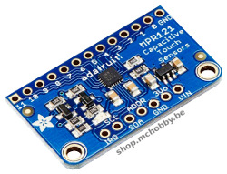
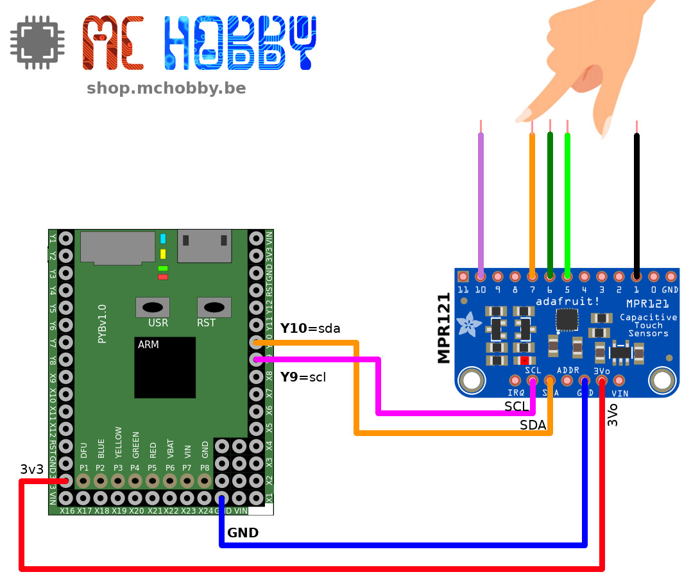
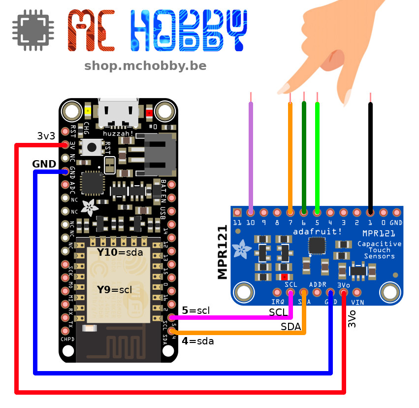

[Ce fichier existe également en FRANCAIS ici](readme.md)

# Using a MPR121 capacitive sensor for 12 key to your MicroPython project

The MPR121 is a specialized chip used to make capacitive touch detection more easily than using analog inputs. The MPR121 already handle the input filtering and can be configured for more/less sensitivity.

The MPR121 is an I2C chip which allow to select up to 4 address for a total of 48 capacitive touch pads (whoaw!).



For more information, please check this [product sheet](http://shop.mchobby.be/product.php?id_product=1685) or [that one](hhttps://www.adafruit.com/product/1982).

# Wiring

## To Pyboard



## To ESP8266



# Test it

The MPR121 library must be installed prior to use example code.

The `mpr121.py` library is available [HERE from MicroPython.org GitHub repository](https://github.com/mcauser/micropython-mpr121/blob/master/mpr121.py). Download and made it available on your MicroPython board.

The `test.py` script test the main and detects if keys (from 0 to 11) is/are touched.

``` python
from machine import I2C
from time import sleep
from mpr121 import MPR121

# Pyboard - SDA=Y10, SCL=Y9
i2c = I2C(2)
# ESP8266 sous MicroPython
# i2c = I2C(scl=Pin(5), sda=Pin(4))

mpr = MPR121( i2c )

while True:
	print( "="*40)
	for i in range(12): # 0 to 11
		if mpr.is_touched(i):
			print( "Entry %2s: TOUCHED" % i  )
		else:
			print( "Entry %2s: " % i  )
	sleep(1)
```

The main issue of the previous example is that repeated call to `is_touched(key_nr)` which starts a I2C communication for each call to the method.

As I2C is relatively slow regarding to processing speed and memory access.
This second version named `fasttest.py` read the data once then compute the value for the twelve key.


``` python
from machine import I2C
from time import sleep
from mpr121 import MPR121

# Pyboard - SDA=Y10, SCL=Y9
i2c = I2C(2)
# ESP8266 sous MicroPython
# i2c = I2C(scl=Pin(5), sda=Pin(4))

mpr = MPR121( i2c )

touched = bytearray( 12 ) # will contains the value for every pin

while True:
	print( "="*40)
	# Reading and decoding (as fast as possible)
	data = mpr.touched()
	for i in range( 12 ):
		touched[i] = 1 if data & (1<<i) else 0

	# Display the result
	for i in range(12): # 0 to 11
		if touched[i]: # Value > 0 means touched!
			print( "Entry %2s: TOUCHED" % i  )
		else:
			print( "Entry %2s: " % i  )
	sleep(0.1)
```

# Where to buy
* [MPR121 Capteur capacitif 12 touches breakout @ MC Hobby](http://shop.mchobby.be/product.php?id_product=1685)
* [12-Key Capacitive Touch Sensor Breakout @ Adafruit](https://www.adafruit.com/product/1982)
