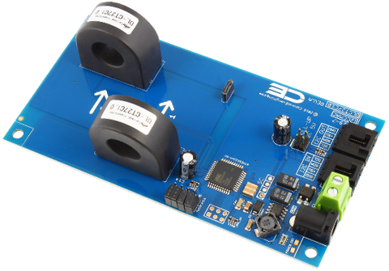
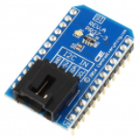
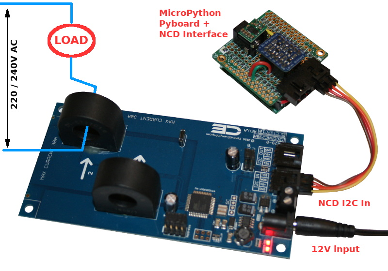
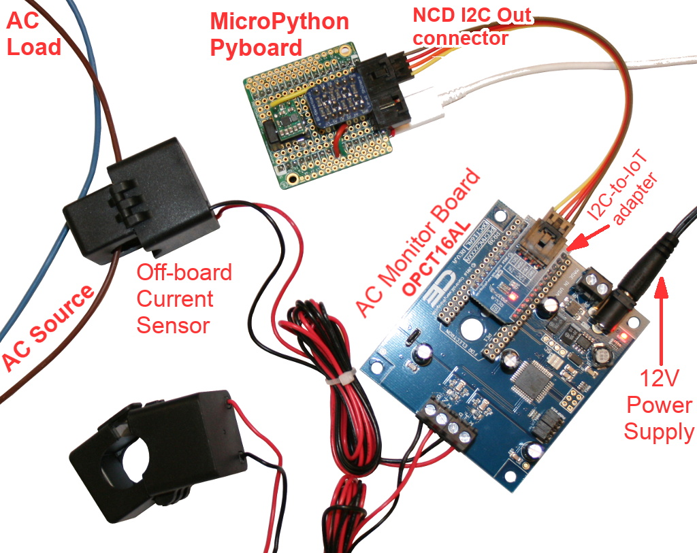
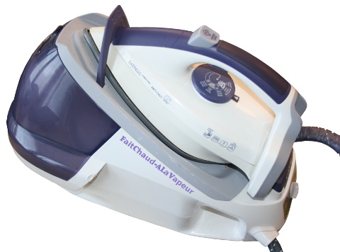

[Ce fichier existe également en FRANCAIS](readme.md)

# Multi-Channels Accuracy AC Current Monitor with I2C Interface

PECMAC are AC Current sensor __is available in many flavour__ (channels & currents) and this one has NCD Connector (easier to wire).

The AC-Sensor (aka PECMAC) have been tested in two flavour:
* 2-Channel on-board AC Current Monitor
* 2-Channel off-board AC Current Monitor with IoT interface

## 2-Channel On-Board 97% Accuracy AC Current Monitor - I2C Interface



The [tested DLCT27C10 board](https://store.ncd.io/product/2-channel-on-board-97-accuracy-ac-current-monitor-with-i2c-interface/) have 2 channels but it also exits with many more channels.
* I2C Current Monitoring Controller
* 2-Channel Input with 10, 20, 30, 50, or 70-Amp Input Range
* Ideal for use with PC using Windows 8/10 via USB
* Compatible with Arduino, Raspberry Pi, Onion, PyCom
* Solid Core Current Sensors with 3% Max Error Rate
* Cross-Platform Compatible I2C Communications
* On-Board I2C Expansion Port
* Expandable to 16 Devices per I2C Port
* 0x2A I2C Start Address
* [Datasheet](https://media.ncd.io/sites/2/20170721135011/Current-Monitoring-Reference-Guide-12.pdf)
* [PECMAC Drivers](https://github.com/ControlEverythingCommunity/PECMAC)

## 2-Channel Off-Board 98% Accuracy AC Current Monitor with IoT interface


The [tested OPCT16AL board](https://store.ncd.io/product/2-channel-off-board-98-accuracy-ac-current-monitor-with-iot-interface/) have 2 channels but it also exits with many more channels.
* 2-Channel 10 to 100-Amp Current Measurement for IoT Energy Monitoring
* Energy Monitoring for IoT Cloud Applications
* Use with Particle Electron for Cellular Communications
* Use with Particle Photon for WiFi Communications
* Use with Bluz Bluetooth Low Energy (BLE) Communications
* Adaptable to Raspberry Pi, Arduino, and Other Platforms
* On-Board Processor Manages all Measurement Conversions
* I2C Expansion Port Offers Extensive Expansion Options

To use it with the MicroPython Pyboard, we do need an [I2C to IoT adapter](https://store.ncd.io/product/i2c-to-iot-interface-adapter/) to have an NCD I2C Input connector (instead of the IoT plateform).



## About NCD Modules
The NCD I2C Mini Modules are designed with a standard & convenient 4-Pin plug connector. Thanks to the connector, it eliminating the need for soldering and the devices can be daisy-chained onto the I2C Bus.

This NCD AC Current Sense board own its how microcontroler and is feed with a separate 12V PSU.

# Wiring

It is a I2C sensor based on NCD connector, so use the appropriate interface to connect it. This repository propose NCD interface for [MicroPython Pyboard](https://github.com/mchobby/pyboard-driver/blob/master/NCD/README.md) and [ESP modules](../NCD/readme.md).






Notice that __National Control Device propose [many adapter board](https://store.ncd.io/shop/?fwp_product_type=adapters) __ for many development plateform.

# Testing
Copy the file `pecmac.py` and `test.py` on your MicroPython board.

The `test.py` script (listed here under) will work with all PECMAC board. It can be loaded from REPL session with `import test`

```
from machine import I2C, Pin
from pecmac import PECMAC, PECMAC_SENSOR_TYPES
import time

# Create the I2C bus accordingly to your plateform.
# Pyboard: SDA on Y9, SCL on Y10. See NCD wiring on https://github.com/mchobby/pyboard-driver/tree/master/NCD
#         Default bus Freq 400000 = 400 Khz is to high.
#         So reduce it to 100 Khz. Do not hesitate to test with 10 KHz (10000)
i2c = I2C( 2, freq=100000 )
# Feather ESP8266 & Wemos D1: sda=4, scl=5.
# i2c = I2C( sda=Pin(4), scl=Pin(5) )
# ESP8266-EVB
# i2c = I2C( sda=Pin(6), scl=Pin(5) )

# Use address parameter as suited
board = PECMAC( i2c )
print( 'Sensor Type : %d (%s)' % (board.sensor_type, PECMAC_SENSOR_TYPES[board.sensor_type]) )
print( 'Max current : %d' % board.max_current )
print( 'Channels    : %d' % board.channels    )

print( '' )
print( 'Read Channels Calibration :' )
for ch in range(1, board.channels+1 ):
	print( 'Channel %s = %i' % (ch, board.read_calibration(ch)) )

# board.raw_values will return one entry per channels
# raw_values are more appropriates for computation.
print( '' )
print( 'Reading Channels RAW value (floats):' )
print( board.raw_values )

print( '' )
print( 'Human Friendly values (textual):')
while True:
	# board.values will return one entry per channels
	print( board.values )
	time.sleep(1)
```

which produce the following results on the DLCT27C10 on-board AC-Sens board + Load made of a Steam Iron wired on channel 2:



```
Sensor Type : 2 (DLCT27C10)
Max current : 30
Channels    : 2

Read Channels Calibration :
Channel 1 = 855
Channel 2 = 855

Reading Channels RAW value (floats):
(0.0, 0.0)

Human Friendly values (textual):
('0.000A', '0.000A')
('0.000A', '0.000A')
('0.000A', '3.513A')  --> Staring the iron
('0.000A', '9.418A')  --> Start boiling the water
('0.000A', '9.418A')
('0.000A', '9.330A')
('0.000A', '9.300A')
('0.000A', '9.330A')
('0.000A', '9.330A')
('0.000A', '9.300A')
('0.000A', '9.330A')
('0.000A', '9.300A')
('0.000A', '9.330A')
('0.000A', '9.300A')
('0.000A', '9.300A')
('0.000A', '9.300A')
('0.000A', '9.300A') --> End of boiling
...
('0.000A', '3.484A') --> Still heating the iron soleplate
('0.000A', '3.484A')
('0.000A', '3.484A')
...
('0.000A', '0.000A') --> Completely warm
('0.000A', '0.000A')
('0.000A', '3.484A') --> Adjust the temperature on iron soleplate
...
```
This second test (with `test.py`) have been made with the OPCT16AL AC Sensor monitor (which one having the off-board sensors).


```
Sensor Type : 4 (OPCT16AL)
Max current : 30
Channels    : 2

Read Channels Calibration :
Channel 1 = 1845
Channel 2 = 1845

Reading Channels RAW value (floats):
(0.0, 0.0)

Human Friendly values (textual):
('0.000A', '0.000A')
('0.000A', '0.000A')
('0.054A', '0.000A') --> Plug the Vaccum Cleaner
('3.924A', '0.000A') --> Start the Vaccum Cleaner
('3.632A', '0.000A')
('6.127A', '0.000A')
('2.144A', '0.000A')
('6.028A', '0.000A')
('5.216A', '0.000A')
('5.964A', '0.000A')
('3.632A', '0.000A')
('6.028A', '0.000A')
```


# Where to buy
* NCD-PR29-6_10A (PECMAC) : http://shop.mchobby.be/
* NCD-PR29-6_10A (PECMAC): https://store.ncd.io/product/2-channel-on-board-97-accuracy-ac-current-monitor-with-i2c-interface/
* NCD-OPCT16AL (PECMAC): https://store.ncd.io/product/2-channel-off-board-98-accuracy-ac-current-monitor-with-iot-interface/
* NCD-PR37-3 (I2C to IoT Adapter): https://store.ncd.io/product/i2c-to-iot-interface-adapter/
