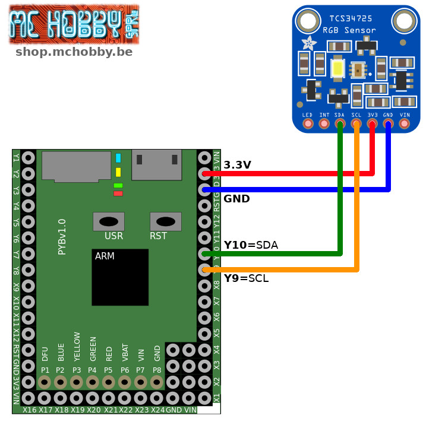

[This file also exists in ENGLISH](readme_ENG.md)

# Lire la couleur d'un object avec le TCS34725 (Adafruit ADA1334) et MicroPython

TCS34725 est un breakout équipé d'un capteur RGB, capteur en lumière visible et filtre IR bloquant.


Le filtre signifie seulement que plus de vraie couleur que la plupart des capteurs, en effet, l'oeil humain ne perçoit les infrarouges. Le capteur dispose d'un temps d'intégration ajustable ainsi qu'un gain ajustable, il peut donc être utilisé derrière une vitre foncée.

# Brancher

## MicroPython Pyboard



## Feather ESP8266 under MicroPython


# Tester

Pour utiliser ce capteur, il est nécessaire de copier la bibliothèque `tcs34725.py` sur votre carte MicroPython.

Avec le code suivant, il est possible de lire les Kelvin et Lux depuis le capteur. La température (en ° Kelvin) inclus également une informations sur la couleur ([voir ce lien](https://andi-siess.de/rgb-to-color-temperature/))

``` python
import time
from machine import I2C
from tcs34725 import TCS34725

# Pyboard - SDA=Y10, SCL=Y9
i2c = I2C(2)
# ESP8266 sous MicroPython
# i2c = I2C(scl=Pin(5), sda=Pin(4))

sensor = TCS34725(i2c)

# boucle principale lisant les ° Kelvin et les imprimants toutes les secondes.
while True:
    # Lire la température de la couleur et luminosité en lux.
    temp = sensor.color_temperature
    lux = sensor.lux
    print('Temperature: {0}K Lux: {1}'.format(temp, lux) )
    time.sleep(1)
```

La lecture de la couleur peut également être fait avec le script suivant (voir fichier `rgb_read.py`).

Attention, pour une lecture optimale, le temps d'intégration doit être plus long et une correction gamma est parfois souhaitable. __L'OBJECT DOIT ETRE CORRECTEMENT PLACE__ pour renvoyer la lumière de la LED (et la couleur) vers le capteur RGB.

``` python
import time
from machine import I2C
from tcs34725 import TCS34725

# Pyboard - SDA=Y10, SCL=Y9
i2c = I2C(2)
# ESP8266 sous MicroPython
# i2c = I2C(scl=Pin(5), sda=Pin(4))

sensor = TCS34725(i2c)
sensor.integration_time = 200 # Temps d'intégration plus grand = plus d'information collectée

def gamma_255( x ):
    """ Appliquer une correction gamma sur une valeur entre 0 - 255 """
    x /= 255
    x = pow(x, 2.5)
    x *= 255
    return int(x) if x < 255 else 255

def gamma_color( color ):
    """ Appliquer la correction gamma à un tuple de couleur rgb.
        Les yeux ne perçoivent pas les gammes de couleur de façon linéaire """
    return gamma_255(color[0]), gamma_255(color[1]), gamma_255(color[2])


while True:
    # Lecture de la couleur sur le capteur
    rgb = sensor.color_rgb_bytes    # color_rgb_bytes
    gamma_rgb = gamma_color( rgb )  # Appliquer correction Gamma
    print( "rgb : %s   gamma_rgb : %s" % (rgb, gamma_rgb) )
    time.sleep(1)
```

# ressources
* [RGB Color vs K temperature](https://andi-siess.de/rgb-to-color-temperature/) andi-siess.de
* [chameleon scarf](https://learn.adafruit.com/chameleon-scarf/code) Adafruit.com

# Où acheter
* [Adafruit TCS34725 (ADA1334)](https://shop.mchobby.be/product.php?id_product=1513) @ MC Hobby
* [Adafruit TCS34725 (ADA1334)](https://www.adafruit.com/product/1334) @ Adafruit
