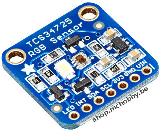
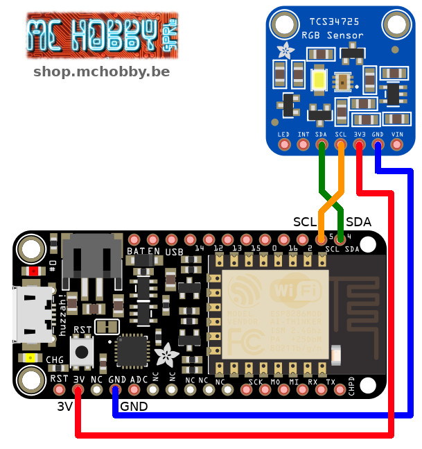

[Ce fichier existe aussi en FRANCAIS](readme.md)

# Read color with the Adafruit TCS34725 (ADA1334) and MicroPython

TCS34725 breakout has  RGB and Clear light sensing elements and  IR blocking filter.



The filter means you'll get much truer color than most sensors, since humans don't see IR. The sensor have adjustable integration time and gain so it is suited for use behind darkened glass.

# Wiring

## MicroPython Pyboard


## Feather ESP8266 under MicroPython



# Test

To use this sensor, you will to copy the `tcs34725.py` to your MicroPython board.

With the following code, you can read the Kelvin and Lux from the sensor. Kelvin also carry-out color information ([see this link](https://andi-siess.de/rgb-to-color-temperature/))

``` python
import time
from machine import I2C
from tcs34725 import TCS34725

# Pyboard - SDA=Y10, SCL=Y9
i2c = I2C(2)
# ESP8266 sous MicroPython
# i2c = I2C(scl=Pin(5), sda=Pin(4))

sensor = TCS34725(i2c)

# Main loop reading color and printing it every second.
while True:
    # Read the color temperature and lux of the sensor too.
    temp = sensor.color_temperature
    lux = sensor.lux
    print('Temperature: {0}K Lux: {1}'.format(temp, lux) )
    time.sleep(1)
```

Reading the color can be made with the following script (see `rgb_read.py`).

Please note that for optimal reading, the integration time should be longer and that gamma correction is suitable. __THE OBJECT MUST BE PROPERLY PLACED__ to reflect LED's light (and color) to the RGB sensor.

``` python
import time
from machine import I2C
from tcs34725 import TCS34725

# Pyboard - SDA=Y10, SCL=Y9
i2c = I2C(2)
# ESP8266 sous MicroPython
# i2c = I2C(scl=Pin(5), sda=Pin(4))

sensor = TCS34725(i2c)
sensor.integration_time = 200 # Bigger integration time = more data collected

def gamma_255( x ):
    """ Apply a gamma correction factor for a value in the range 0 - 255 """
    x /= 255
    x = pow(x, 2.5)
    x *= 255
    return int(x) if x < 255 else 255

def gamma_color( color ):
    """ Apply the Gamma correction to a tuple of rgb color.
        Eyes does not sense the color range in a linear way """
    return gamma_255(color[0]), gamma_255(color[1]), gamma_255(color[2])


while True:
    # Read the color at the sensor
    rgb = sensor.color_rgb_bytes    # color_rgb_bytes
    gamma_rgb = gamma_color( rgb )  # Apply Gamma
    print( "rgb : %s   gamma_rgb : %s" % (rgb, gamma_rgb) )
    time.sleep(1)
```

# ressources
* [RGB Color vs K temperature](https://andi-siess.de/rgb-to-color-temperature/) andi-siess.de
* [chameleon scarf](https://learn.adafruit.com/chameleon-scarf/code) Adafruit.com

# Shopping list
* [Adafruit TCS34725 (ADA1334)](https://shop.mchobby.be/product.php?id_product=1513) @ MC Hobby
* [Adafruit TCS34725 (ADA1334)](https://www.adafruit.com/product/1334) @ Adafruit
