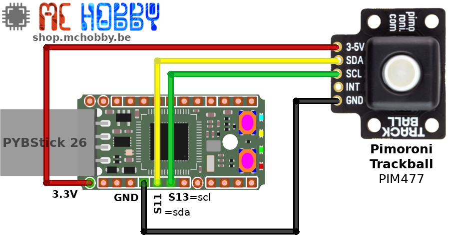

[This file also exists in ENGLISH](readme_ENG.md)

# Ajouter un Trackball + LED RGBW à votre projet MicroPython

Les trackball étaient connu et utilisé sur de nombreux périphériques. Toujours disponibles de nos jours, les trackballs permettent de créer des interfaces homme-machine compacte et intuitives.

Pimoroni à eu l'excellente idée de placer ce trackball sur une carte breakout ainsi qu'un MicroControleur permettant facilitant la gestion des interactions avec le trackball.

Ce n'est pas tout, le trackball est équipé d'une LED RGBW (rouge, vert, bleu, blanc) sous la bille permettant de l'illuminer avec la couleur de votre choix. En animant cette LED, il devient possible au projet d'interagir avec l'utilisateur.


Enfin, comme il s'agit d'un composant I2C, il ne fait que deux signaux pour interagir avec le trackball. La présence du bit d'adresse permet de placer jusque deux trackball sur le bus I2C.

__Note:__ la bibliothèque ne prend pas en charge la gestion de la broche d'interruption. Le breakout et son microcontrôleur propose également un mécanisme de lecture de l'interruption par voie logicielle (via le registre REG_INT); c'est cette dernière méthode qui est utilisée par la bibliothèque.

# Brancher

## Avec Pyboard


## Avec PYBStick

Le PYBStick est une carte MicroPython très compacte et bon marché.



# Tester

Il sera nécessaire de copier la bibliothèque [trackball.py](lib/trackball.py) sur votre carte MicroPython avant pouvoir utiliser le breakout et les exemples repris ci-dessous.

## test_readall
Le script [test_readall.py](examples/test_readall.py) effectue une lecture sur le trackball et l'état de tous les éléments.

Ce script est relativement simple:

```
from machine import I2C
from trackball import Trackball
import time

i2c = I2C(2) # Y9=scl, Y10=sda or Pyboard-Uno-R3 (I2C over pin 13)

# initialise le trackball
trackball = Trackball( i2c )

# Allume le trackball en rouge
trackball.set_rgbw(255, 0, 0, 0)

while True:
	up, down, left, right, switch, state = trackball.read()
	print("r: {:02d} u: {:02d} d: {:02d} l: {:02d} switch: {:03d} state: {}".format(right, up, down, left, switch, state))
	time.sleep(0.200)
```

Ce qui affiche les résultats suivant:

```
r: 00 u: 00 d: 00 l: 06 switch: 000 state: False
r: 00 u: 00 d: 00 l: 04 switch: 000 state: False
r: 02 u: 00 d: 00 l: 00 switch: 000 state: False
r: 06 u: 00 d: 00 l: 00 switch: 000 state: False
r: 09 u: 00 d: 00 l: 00 switch: 000 state: False
r: 01 u: 00 d: 00 l: 00 switch: 000 state: False
r: 04 u: 00 d: 00 l: 00 switch: 000 state: False
r: 00 u: 00 d: 00 l: 00 switch: 000 state: False
r: 02 u: 00 d: 00 l: 00 switch: 000 state: False
r: 00 u: 00 d: 00 l: 00 switch: 000 state: False
r: 00 u: 00 d: 00 l: 00 switch: 000 state: False
...
r: 00 u: 00 d: 01 l: 00 switch: 000 state: False
r: 00 u: 00 d: 02 l: 00 switch: 000 state: False
r: 00 u: 00 d: 01 l: 00 switch: 001 state: True
r: 00 u: 00 d: 00 l: 00 switch: 000 state: True
r: 00 u: 00 d: 00 l: 00 switch: 000 state: True
r: 00 u: 00 d: 00 l: 00 switch: 000 state: True
r: 00 u: 00 d: 00 l: 00 switch: 000 state: True
```

Où les informations r,u,d,l correspondent respectivement à droite (right), haut (up), bas (down), gauche (left).

Le paramètre "switch" indique le changement d'état du switch et passe à 1 lorsqu'il est enfoncé ou relâché. Le paramètre "state" indique juste si le bouton est enfoncé ou non.

## Autres Exemples
Le répertoire `examples` contient d'autres scripts d'exemples:
* [test_readall.py](examples/test_readall.py) : présenté ci-dessus, lit continuellement les données en provenance du trackball
* [test_controlcolor.py](examples/test_controlcolor.py) : change la couleur du trackball en pressant le trackball et en bougeant la bille.
* [test_rainbow.py](examples/test_rainbow.py) : cycle des couleurs sur le trackball.

# Où acheter
* Le [TrackBall PIM477 de Pimoroni](https://shop.mchobby.be/fr/tactile-flex-pot-softpad/1833-trackball-i2c-ave-retro-eclairage-3232100018334-pimoroni.html) est disponible chez MCHobby
* Le [TrackBall PIM477 de Pimoroni](https://shop.pimoroni.com/products/trackball-breakout) est disponible chez Pimoroni
* [MicroPython PYBStick](https://shop.mchobby.be/fr/micropython/1844-pybstick-standard-26-micropython-et-arduino-3232100018440-garatronic.html)
* [MicroPython Pyboard](https://shop.mchobby.be/fr/micropython/570-micropython-pyboard-3232100005709.html)
