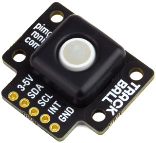
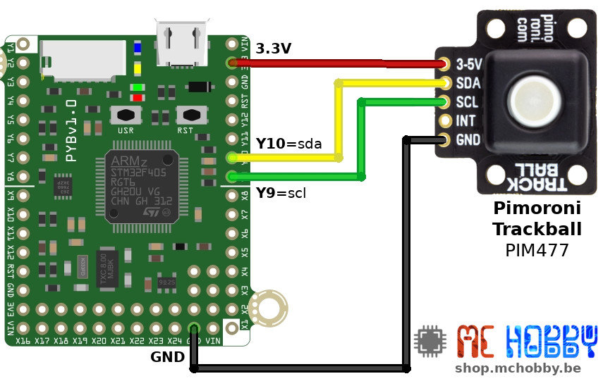

[Ce fichier existe aussi en FRANCAIS](readme.md)

# Add a Trackball + RGBW LED to you MicroPython project

The trackball cas very popular and used on many peripherals (like smartphones). Still available nowadays, the trackballs can be used to create neat and compact machine interface. Trackballs are also very intuitive to use.

Pimoroni did have the great ides to associate a trackball with a tiny microcontroler on a breakout board. All the complexity of the trackball tracking is handled by the microcontroler whicj expose a I2C bus to connect to.

Even better, a RGBW LED (red, green, blue, white) under the ball that can illuminate it with any color. By controling the LED, it is possible return visual acknoledgment to the user.



As it is an I2C breakout, only 2 signal wires are needed to interact with the breakout. As the breakout also have an addess jumper then it is possible to use 2 trackballs on a signle I2C bus.

__Note:__ the library does not handle the interrupt pin. The breakout and its microcontroler also offer a software support to capture that interrupt (via the REG_INT register); the micropython library use that software method.

# Wiring

## with Pyboard



## With PYBStick

The PYBStick is a very compact et low cost MicroPython board.


# Test

It will be necessary to copy the [trackball.py](lib/trackball.py) library on the MicroPython board before using this breakout and the examples here below.

## test_readall
The [test_readall.py](examples/test_readall.py) script continuously read the trackball states and display it on the screen.

The script is quite simple:

```
from machine import I2C
from trackball import Trackball
import time

i2c = I2C(2) # Y9=scl, Y10=sda or Pyboard-Uno-R3 (I2C over pin 13)

# initialize le trackball
trackball = Trackball( i2c )

# light-up the trackball in rouge
trackball.set_rgbw(255, 0, 0, 0)

while True:
	up, down, left, right, switch, state = trackball.read()
	print("r: {:02d} u: {:02d} d: {:02d} l: {:02d} switch: {:03d} state: {}".format(right, up, down, left, switch, state))
	time.sleep(0.200)
```

which will display the following results:

```
r: 00 u: 00 d: 00 l: 06 switch: 000 state: False
r: 00 u: 00 d: 00 l: 04 switch: 000 state: False
r: 02 u: 00 d: 00 l: 00 switch: 000 state: False
r: 06 u: 00 d: 00 l: 00 switch: 000 state: False
r: 09 u: 00 d: 00 l: 00 switch: 000 state: False
r: 01 u: 00 d: 00 l: 00 switch: 000 state: False
r: 04 u: 00 d: 00 l: 00 switch: 000 state: False
r: 00 u: 00 d: 00 l: 00 switch: 000 state: False
r: 02 u: 00 d: 00 l: 00 switch: 000 state: False
r: 00 u: 00 d: 00 l: 00 switch: 000 state: False
r: 00 u: 00 d: 00 l: 00 switch: 000 state: False
...
r: 00 u: 00 d: 01 l: 00 switch: 000 state: False
r: 00 u: 00 d: 02 l: 00 switch: 000 state: False
r: 00 u: 00 d: 01 l: 00 switch: 001 state: True
r: 00 u: 00 d: 00 l: 00 switch: 000 state: True
r: 00 u: 00 d: 00 l: 00 switch: 000 state: True
r: 00 u: 00 d: 00 l: 00 switch: 000 state: True
r: 00 u: 00 d: 00 l: 00 switch: 000 state: True
```

Where the r,u,d,l information corresponding to right, up, down, left.

The "switch" value concerns the state change of the switch. It goes to 1 when the button is pressed or released. The "state" column indicates if the button is down or up.

## Other examples
The `examples` folder contains some other scripts:
* [test_readall.py](examples/test_readall.py) : (see here above) will continuously read the trackball state and display it on the screen.
* [test_controlcolor.py](examples/test_controlcolor.py) : change the color of the trackball by pressing the ball and scrolling it.
* [test_rainbow.py](examples/test_rainbow.py) : color cycle the trackball.

# Shopping list
* [TrackBall PIM477 from Pimoroni](https://shop.mchobby.be/fr/tactile-flex-pot-softpad/1833-trackball-i2c-ave-retro-eclairage-3232100018334-pimoroni.html) available at MCHobby
* [TrackBall PIM477 from Pimoroni](https://shop.pimoroni.com/products/trackball-breakout) available at Pimoroni
* [MicroPython PYBStick](https://shop.mchobby.be/fr/micropython/1844-pybstick-standard-26-micropython-et-arduino-3232100018440-garatronic.html)
* [MicroPython Pyboard](https://shop.mchobby.be/fr/micropython/570-micropython-pyboard-3232100005709.html)
